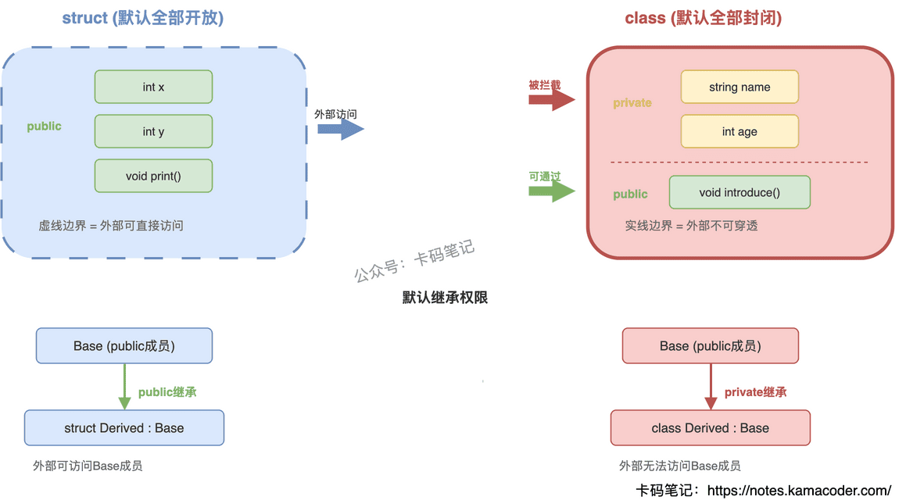
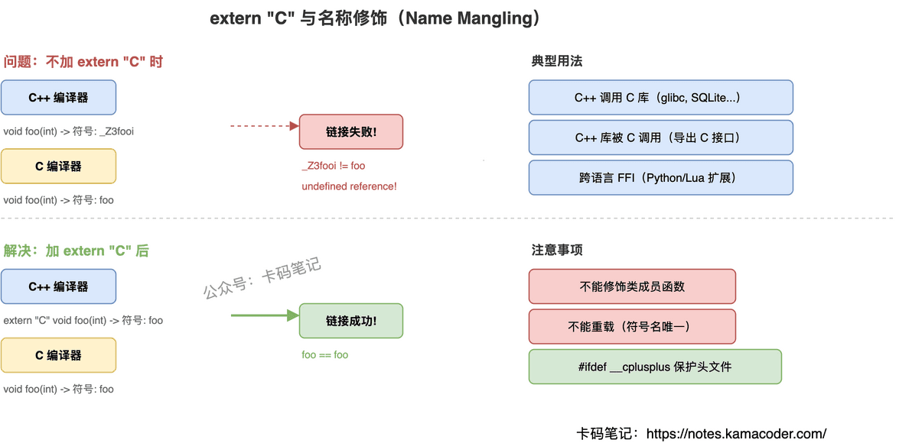
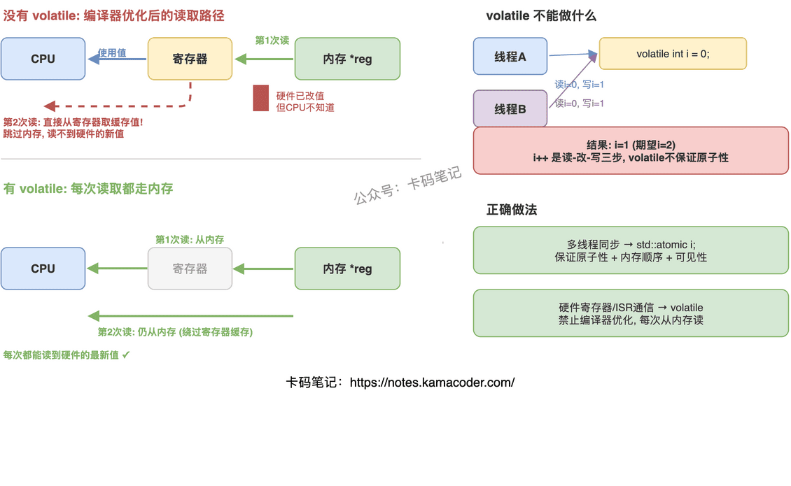
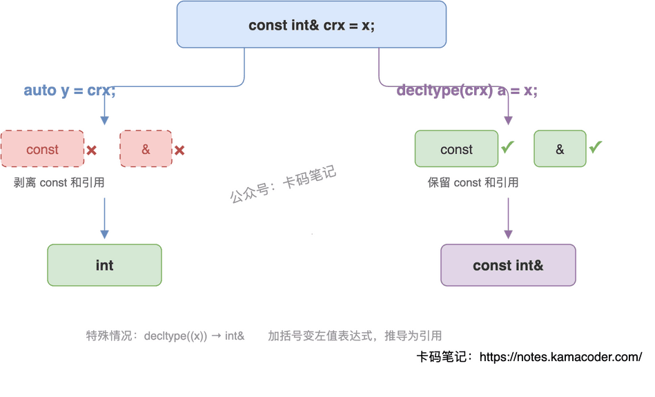
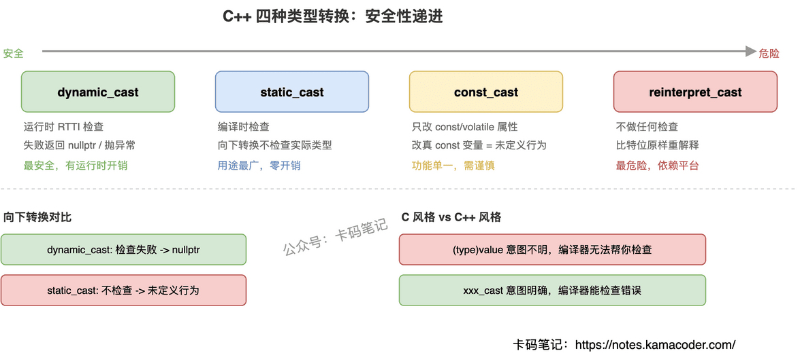

# 基础与语法

## 1. C++三大特性：封装、继承、多态

面试官问："介绍一下 C++ 的三大特性。"

这题几乎每场 C++ 面试都会问，但答"封装继承多态"六个字肯定不够。面试官想听的是：每个特性解决什么问题、多态的底层怎么实现的、vtable 和 vptr 怎么配合工作。

### 简要回答

**封装**：把数据和操作打包在类里，通过 `public`/`private`/`protected` 控制访问权限，外部只能通过接口操作，不能直接改内部数据。

**继承**：子类复用父类的属性和方法，在原有功能基础上扩展，避免重复代码。

**多态**：同一个接口，不同对象调用表现不同。分编译时多态（函数重载、模板）和运行时多态（虚函数 + 继承）。

### 详细回答

**封装**

核心思想是"隐藏实现细节，暴露接口"。`private` 成员外部不可访问，`protected` 成员子类可访问，`public` 成员所有人可访问。好处是提高安全性，修改内部实现不影响外部调用者。

**继承**

子类自动拥有父类的非私有成员，可以重写（override）父类方法来改变行为。比如定义 `Animal` 基类，派生出 `Dog`、`Cat`，共享 `name` 属性但各自实现不同的 `speak()` 方法。

继承有三种方式：`public`（最常用，保持父类接口）、`protected`、`private`，区别在于父类成员在子类中的访问级别变化。

**多态**

多态是三大特性中面试问得最深的。

- **编译时多态（静态绑定）**：函数重载、运算符重载、模板。编译阶段就确定调用哪个函数。
- **运行时多态（动态绑定）**：通过虚函数实现。基类指针/引用指向派生类对象时，调用的是派生类的重写版本，而不是基类版本。

运行时多态的底层机制：

1. 每个含虚函数的类，编译器生成一张 **vtable**（虚函数表），存放该类所有虚函数的地址
2. 每个对象内部有一个隐藏的 **vptr**（虚指针），指向所属类的 vtable
3. 通过基类指针调用虚函数时，程序顺着 vptr 找到 vtable，再从表里取出实际函数地址调用

vtable 是类级别的（同类所有对象共享一张表），vptr 是对象级别的（每个对象各有一个）。

### 知识拓展

面试官可能追问：

**Q1: 编译时多态能替代运行时多态吗？**

不完全能。编译时多态要求类型在编译期就确定，适合"类型已知但行为不同"的场景（比如模板）。运行时多态适合"类型运行时才确定"的场景（比如工厂模式返回基类指针）。如果类型编译期能确定又想避免虚函数开销，可以用 CRTP（奇异递归模板模式）模拟。

**Q2: vtable 和 vptr 具体怎么工作的？**

`Animal* a = new Dog()` 时，Dog 对象的 vptr 指向 Dog 的 vtable。调用 `a->speak()` 时，编译器生成的代码是：取 a 的 vptr → 在 vtable 中找 speak 的偏移 → 调用那个地址。所以即使 a 的静态类型是 Animal\*，实际调用的是 Dog::speak()。

**Q3: 不用虚函数能实现运行时多态吗？**

能，但比较 hack。可以用函数指针成员、`std::function` + 策略模式、或者类型擦除（type erasure）。标准库的 `std::function` 就是用类型擦除实现的"无虚函数多态"。

---

## 2. 指针与引用的区别

面试官问"指针和引用有什么区别"，大多数人能答出"指针可以为空，引用不行"，但接着追问"底层实现有什么不同""const 怎么修饰""什么场景该用哪个"，就开始含糊了。

这道题考的不是背定义，而是你对 C++ 内存模型的理解深度。把几个核心维度讲清楚，面试官就不会继续追了。

### 简要回答

指针是**存储地址的独立变量**，可重新赋值、可为空、支持算术运算，但需要手动管理内存。引用是**变量的别名**，必须初始化、不能为空、绑定后不可更改，编译器不为其分配独立存储空间。

一句话区分：**指针是"我知道他住哪"，引用是"我就是他的另一个名字"。**

### 详细回答

| 维度 | 指针 | 引用 |
| --- | --- | --- |
| 本质 | 存储地址的变量 | 变量的别名 |
| 内存占用 | 独立占 4/8 字节 | 无独立存储（编译器内部可能用指针实现，但语义上不占空间） |
| 初始化 | 可延迟初始化 | **必须在声明时初始化** |
| 空值 | 可为 `nullptr` | **不能为空** |
| 重新绑定 | `p = &b` 随时改指向 | 绑定后终身不变 |
| 多级间接 | 支持 `int**` 指针的指针 | 不存在"引用的引用" |
| 算术运算 | 支持 `p++`、`p+n` | 不支持 |
| 访问目标 | 需解引用 `*p` | 直接使用，语法透明 |
| sizeof | 返回指针本身大小（4/8） | 返回绑定对象的大小 |
| const 修饰 | `const int*`（指向const）、`int* const`（指针本身const）、`const int* const`（双const） | 没有"const引用"的说法，`const int&` 是"绑定到const对象的引用" |

**关于 const 修饰指针**，记住一个口诀：**const 在 `*` 左边修饰指向的值，在 `*` 右边修饰指针本身**。`const int* p` 不能改值但能改指向，`int* const p` 能改值但不能改指向。

引用本身没有 const 的概念——因为引用绑定后本来就不能改，天然就是"const"的。`const int& r` 的 const 修饰的是被引用的对象，不是引用本身。

### 知识拓展

**Q：底层实现上，引用真的不占内存吗？**

语义上不占，但编译器实现时通常用指针来存引用的地址。区别在于编译器保证引用不会为空、不会重新绑定，这些约束在编译期就检查了，运行时引用和指针的机器码可能一样。

**Q：什么时候用指针，什么时候用引用？**

需要表达"可能没有"（可选参数、可能为空）→ 用指针。需要改变指向（遍历链表、动态分配）→ 用指针。其他情况一律优先用引用，语法干净、不用判空、不会野指针。现代 C++ 里，裸指针越来越少，能用引用就用引用，需要所有权语义就用智能指针。

**Q：函数参数传递时，指针和引用有性能差异吗？**

没有。编译器生成的代码几乎一样，都是传地址。选择依据是语义而非性能：参数一定存在用引用，参数可能为空用指针。

**Q：引用能绑定到临时对象吗？**

普通左值引用不行，但 `const int&` 可以绑定临时对象并延长其生命周期。C++11 的右值引用 `int&&` 专门用来绑定临时对象，这是移动语义的基础。

---

## 3. struct 与 class 的区别

面试官问"struct 和 class 有什么区别"，大多数人只答出"默认访问权限不同"就停了。但面试官往往会追问：继承时默认权限呢？模板参数里能用 struct 吗？实际项目中怎么选？能把这几层都答清楚，才算完整。

### 简要回答

C++ 中 struct 和 class 在语法能力上完全等价，区别只有两个默认行为：struct 成员和继承默认 public，class 默认 private。另外模板参数只能用 `class` 或 `typename`，不能用 `struct`。工程惯例上，struct 用于纯数据聚合，class 用于有封装行为的类型。

### 详细回答

**语法层面的区别（只有三点）**

**第一，默认成员访问权限不同。** struct 的成员默认 public，外部可以直接访问；class 的成员默认 private，必须通过公开接口访问。但两者都可以显式写 `public`/`protected`/`private`，所以这只是默认值的差异，不是能力的差异。

**第二，默认继承权限不同。** `struct Derived : Base` 默认是 public 继承，`class Derived : Base` 默认是 private 继承。private 继承会导致基类的 public 成员在派生类外部不可访问。实际写代码时都会显式写继承权限，不依赖默认行为。

**第三，模板参数声明。** `template<class T>` 或 `template<typename T>` 都合法，但不能写 `template<struct T>`。这是语法规定，和 struct/class 的语义无关。

**工程惯例（非语法强制）**

- **struct**：纯数据聚合，所有成员 public，没有不变量需要维护。典型场景：配置项、坐标点、网络协议包头、POD 类型。
- **class**：有封装需求，内部状态需要通过接口维护不变量。典型场景：业务对象、资源管理器、带构造/析构逻辑的类型。

这个惯例不是编译器强制的，但团队代码风格一致性很重要——看到 struct 就知道"这是个透明的数据包"，看到 class 就知道"这里有封装逻辑"。

### 知识拓展

**Q：struct 里能写 private 成员吗？**

能。struct 和 class 语法能力完全一样，只是默认值不同。你可以在 struct 里写 private、写构造函数、写虚函数，编译器不会阻止。但这样做违反工程惯例，会让读代码的人困惑。

**Q：什么是 POD 类型？和 struct 什么关系？**

POD（Plain Old Data）是指内存布局与 C 兼容的类型：没有虚函数、没有用户定义的构造/析构、所有成员 public、可以用 `memcpy` 安全拷贝。struct 天然适合定义 POD，因为默认 public 且语义上暗示"纯数据"。但 class 也能定义 POD，只要满足条件就行。

**Q：C 的 struct 和 C++ 的 struct 有什么区别？**

C 的 struct 只能有成员变量，不能有成员函数、访问控制、继承。C++ 为了兼容保留了 struct 关键字，但扩展成了和 class 几乎等价的东西。用 `extern "C"` 混编时，共享的结构体定义要保持 C 兼容（不加成员函数和继承）。

**Q：为什么实际项目中很少看到 struct 继承？**

因为 struct 的语义是"纯数据聚合"，继承暗示多态和行为扩展，两者语义冲突。如果需要继承体系，用 class 更符合意图表达。Google C++ Style Guide 明确建议：只有当所有成员都是 public 且没有虚函数时才用 struct。

---

## 4. struct 与 union 的区别

面试官问"struct 和 union 有什么区别"，很多人只答"struct 成员各占各的内存，union 共享内存"就停了。但追问"union 的 sizeof 怎么算""union 里能放 string 吗""现代 C++ 还需要 union 吗"就答不上来了。

### 简要回答

struct 的所有成员各自占用独立内存，sizeof 是所有成员大小之和（加对齐填充）。union 的所有成员共享同一块内存，sizeof 等于最大成员的大小，同一时刻只有一个成员有效。

struct 支持继承、虚函数、完整的面向对象能力。union 不能继承、不能有虚函数、不能有引用成员，成员永远是 public。C++11 后 union 可以放非 POD 类型（如 `std::string`），但必须手动用 placement new 构造、手动调析构。C++17 的 `std::variant` 是 union 的类型安全替代。

### 详细回答

**内存布局——核心差异**

struct 的成员按声明顺序依次排列在内存中，每个成员有自己的地址。一个 `struct { int a; double b; char c; }` 占 24 字节（含对齐填充），三个成员同时存在、互不干扰。

union 的所有成员从同一个起始地址开始，共享同一块内存。一个 `union { int a; double b; char c; }` 只占 8 字节（最大成员 double 的大小）。写入一个成员会覆盖其他成员的值，同一时刻只有一个成员"活跃"。

**能力差异**

struct 本质上就是 class（只是默认 public），拥有完整的面向对象能力：继承、虚函数、模板参数、访问控制。

union 受限很多：不能继承也不能被继承，不能有虚函数，不能有引用成员，所有成员强制 public。但 union 可以有构造函数、析构函数和普通成员函数。

**C++11 后的 union**

C++11 之前 union 只能放 POD 类型。C++11 放开了这个限制，允许放 `std::string` 这样的非 POD 类型，但编译器不会自动调用构造/析构——因为 union 不知道当前哪个成员活跃。开发者必须自己用 placement new 构造、手动调析构函数，否则就是未定义行为。

**现代替代：`std::variant`（C++17）**

`std::variant` 是类型安全的 union 替代品。它内部跟踪当前活跃类型，自动管理构造/析构，访问错误类型时抛异常而不是未定义行为。除非有极致的内存/性能需求，现代 C++ 应该优先用 `std::variant`。

### 知识拓展

**Q：union 的 sizeof 怎么算？**

等于最大成员的大小，再按最大对齐要求向上取整。比如 `union { char c; double d; }` 是 8 字节，不是 1+8。

**Q：union 有什么实际用途？**

两个经典场景：一是二进制协议解析，把一块 buffer 按不同字段解释（网络包头、硬件寄存器）；二是节省内存，当多个字段不会同时使用时共享空间（嵌入式、高性能场景）。但现代 C++ 中这两个场景都有更安全的替代（`std::bit_cast`、`std::variant`）。

**Q：为什么 union 里放 string 需要手动管理？**

因为 union 不知道当前哪个成员活跃，无法在析构时决定调谁的析构函数。如果你写入了 string 但没手动调 `s.~string()`，就会内存泄漏；如果当前活跃的不是 string 却去调它的析构，就是未定义行为。这就是为什么 `std::variant` 更好——它用内部 tag 跟踪活跃类型，自动处理生命周期。

**Q：union 和 struct 的默认访问权限有什么不同？**

struct 默认 public 但可以改成 private/protected。union 的成员永远是 public，不能加访问控制修饰符。这是语法强制的，不是惯例。

---

## 5. static 与 const 关键字的区别

面试官问"static 和 const 分别有什么作用"，很多人能各列几条，但追问"它们修饰同一个东西时语义有什么不同"就答不清楚了。这道题的关键是把两者的核心语义——生命周期/可见性 vs 只读性——分层讲清楚。

### 简要回答

**static 控制的是"在哪活多久"**：让局部变量在函数调用之间持久存在，让全局符号限制在当前文件可见，让类成员被所有对象共享。

**const 控制的是"能不能改"**：把变量标记为只读，把指针/引用标记为不可通过它修改所指对象，把成员函数标记为不会修改对象状态。

两者完全正交，可以同时使用：`static const int X = 42;` 既是共享的、又是只读的。

### 详细回答

**static 的四种用法**

1. **局部静态变量**：生命周期延长到程序结束，但作用域仍在函数内。只初始化一次，后续调用保留上次的值。
2. **文件作用域的 static**：限制符号为内部链接，其他 `.cpp` 文件无法通过 `extern` 访问——实现"文件级私有"。
3. **类的静态成员变量**：属于类本身而非某个对象，所有对象共享同一份，必须在类外定义（C++17 起可用 `inline static` 类内定义）。
4. **类的静态成员函数**：没有 `this` 指针，不能访问非静态成员，可通过 `类名::函数名()` 直接调用。

**const 的四种用法**

1. **修饰普通变量**：标记为只读，赋值会编译报错。
2. **修饰指针**：`const` 在 `*` 左边修饰值（底层 const，指向的内容不可改），在 `*` 右边修饰指针本身（顶层 const，指针不可改指向别处）。`const int* const p` 则两者都不可改。
3. **修饰引用**：`const int& ref = x` 表示不能通过 ref 修改 x，常用于函数参数——避免拷贝又保证不修改。
4. **修饰成员函数**：承诺不修改对象的任何非 `mutable` 成员，const 对象只能调用 const 成员函数。

**核心差异**

| 维度 | static | const |
| --- | --- | --- |
| 核心语义 | 控制生命周期和可见性 | 控制可修改性（只读） |
| 修饰局部变量 | 延长生命周期至程序结束 | 值不可更改 |
| 修饰全局变量 | 限制为文件内部链接 | 默认内部链接 + 只读 |
| 修饰类成员变量 | 所有对象共享一份 | 必须在初始化列表中初始化 |
| 修饰成员函数 | 无 this，可用类名调用 | 不修改成员，const 对象可调用 |

### 知识拓展

**Q：const 和 constexpr 有什么区别？**

const 是"运行时只读"，初始值可以运行时才确定。constexpr 更强，是"编译期常量"，值必须编译时就能算出来，可以用于数组大小、模板参数。简单说：constexpr 一定是 const，但 const 不一定是 constexpr。

**Q：static 局部变量的初始化是线程安全的吗？**

C++11 保证是的（magic statics），编译器底层会加锁确保只有一个线程执行初始化。但初始化之后的读写不是线程安全的，仍需加锁。这也是 Meyer's Singleton 的理论基础——用函数内 `static` 局部变量实现单例。

**Q：mutable 是干什么的？**

允许一个成员变量在 const 成员函数中被修改。典型场景：缓存、访问计数器、互斥锁（`mutable std::mutex mtx_`）。它不破坏逻辑上的 const 语义——对象的可观察状态没变，只是内部实现细节变了。

**Q：const\_cast 能去掉 const 吗？有什么风险？**

能，但如果原始对象本身就是 const 的，去掉后修改是未定义行为。只有对象本身不是 const、只是通过 const 引用传进来的情况下才合法。实际开发中尽量不用。

**Q：不同编译单元的 static 变量初始化顺序有什么坑？**

不同 `.cpp` 文件中的全局/静态变量，初始化顺序是未定义的（Static Initialization Order Fiasco）。如果 A 文件的静态变量依赖 B 文件的静态变量，可能在 B 还没初始化时就被使用。解决办法：用函数内局部 static 变量替代（Construct On First Use），保证首次访问时才初始化。

**Q：C 的 const 和 C++ 的 const 有什么不同？**

C 中 const 变量默认外部链接，不能用于数组大小，本质是"只读变量"。C++ 中 const 默认内部链接，编译器会尝试当编译期常量处理，可以用于数组大小。所以 C++ 的 const 更接近真正的"常量"语义。

---

## 6. extern "C" 的作用

面试官问："extern "C" 是干什么的？为什么需要它？"

这题考的是你对 C++ 底层链接机制的理解。很多人能说出"用于 C/C++ 混合编程"，但问到名称修饰的具体过程、为什么 C++ 需要修饰而 C 不需要、extern "C" 到底改变了什么，就说不清楚了。

### 简要回答

`extern "C"` 告诉 C++ 编译器：对这些函数不要做名称修饰（Name Mangling），直接用原始函数名作为链接符号。

为什么需要？因为 C++ 支持函数重载，编译器必须把参数类型信息编码进函数名（比如 `void foo(int)` 变成 `_Z3fooi`），这样链接器才能区分同名函数。但 C 语言没有重载，函数名就是符号名（`foo` 就是 `foo`）。如果 C++ 代码要调用 C 编译的库，不加 `extern "C"` 的话，C++ 编译器会去找 `_Z3fooi`，而 C 库里只有 `foo`——链接失败，报 "undefined reference"。

### 详细回答

**名称修饰（Name Mangling）是根本原因**

C++ 支持函数重载，同一个函数名可以有不同参数版本。编译器为了在目标文件中区分它们，会把参数类型、命名空间等信息编码进符号名。比如 `void foo(int)` 可能变成 `_Z3fooi`，`void foo(double)` 变成 `_Z3food`。这个过程叫名称修饰。

C 语言没有重载，所以不需要修饰——`void foo(int)` 编译后符号就是 `foo`。

**链接时的冲突**

当 C++ 程序调用 C 库的函数时，C++ 编译器会对函数调用做名称修饰，去找修饰后的符号。但 C 库里的符号是未修饰的原始名。两边对不上，链接器报错。

`extern "C"` 就是解决这个问题的：它告诉编译器"这些函数按 C 的规则来，不要修饰名字"。这样 C++ 编译器生成的符号引用就是原始的 `foo`，能和 C 库里的 `foo` 匹配上。

**调用约定也会受影响**

除了名称修饰，`extern "C"` 通常还意味着使用 C 的调用约定（如 `__cdecl`）。调用约定规定了参数怎么压栈、栈由谁清理等底层细节。C 和 C++ 的调用约定可能不同，`extern "C"` 确保二进制层面完全兼容。

**典型用法：`__cplusplus` 宏保护**

写 C/C++ 通用头文件时，用 `#ifdef __cplusplus` 包裹 `extern "C"`，这样同一个头文件既能被 C 编译器用，也能被 C++ 编译器用。C 编译器看不到 `extern "C"`（因为 `__cplusplus` 未定义），C++ 编译器能看到并正确处理。

### 知识拓展

面试官可能追问：

**Q1: 为什么 C++ 需要名称修饰而 C 不需要？**

因为 C++ 有函数重载——同名函数可以有不同参数版本，编译器必须在符号层面区分它们。C 语言不支持重载，一个函数名只对应一个函数，不需要额外编码。另外 C++ 还有命名空间、模板等特性，这些信息也需要编码进符号名。

**Q2: extern "C" 能修饰类的成员函数吗？**

不能。成员函数隐含 `this` 指针，依赖 C++ 的对象模型，没法用 C 的调用约定。如果想让 C 代码调用 C++ 的类功能，通常的做法是写一个 `extern "C"` 的包装函数（wrapper），内部创建对象、调用成员函数，对外暴露纯 C 接口。

**Q3: extern "C" 的函数能重载吗？**

不能。`extern "C"` 的函数不做名称修饰，符号名就是函数名本身。如果有两个同名的 `extern "C"` 函数（即使参数不同），链接器会报重复定义错误。这也是为什么 C 语言不支持重载的底层原因——没有名称修饰机制来区分同名函数。

**Q4: 实际项目中 extern "C" 最常见的场景是什么？**

三个典型场景：一是 C++ 调用 C 库（如 glibc、SQLite、libpng），需要在 C 库的头文件声明前加 `extern "C"`；二是 C++ 写的库要被 C 程序调用，需要用 `extern "C"` 导出接口函数；三是跨语言交互（如 Python/Lua 扩展），这些语言的 FFI 接口是 C 风格的，C++ 写扩展时必须用 `extern "C"` 导出入口函数。

---

## 7. volatile关键字的作用

面试官问："volatile关键字是干什么的？它能保证线程安全吗？"

这题在嵌入式和后端面试里都常见。很多人能答出"防止编译器优化"，但说不清具体防止了哪种优化，更答不上volatile和std::atomic的本质区别。

### 简要回答

volatile告诉编译器：**这个变量的值可能被程序之外的因素修改**（硬件寄存器、中断服务程序等），所以**每次访问都必须从内存读取，不能用寄存器里的缓存值**。

核心作用就一个：**禁止编译器对该变量的读写做优化**。

### 详细回答

**编译器优化的问题**

正常情况下，编译器看到一个变量在两次读取之间没有写操作，会认为"值没变"，直接用寄存器里缓存的旧值代替第二次内存读取。对普通变量这没问题，但对硬件寄存器或被ISR修改的变量就错了——值确实在程序不知情的情况下变了。

**volatile做了什么**

- 禁止编译器把变量缓存到寄存器，**每次读写都走内存**
- 禁止编译器重排与volatile变量相关的指令（仅限编译器层面，CPU重排需要内存屏障）
- 禁止编译器把对volatile变量的读写当作"无效操作"消除

**典型场景**

硬件寄存器映射：`volatile uint32_t* reg = (volatile uint32_t*)0x4000;`，硬件随时改值，不加volatile编译器会把第二次读取优化掉。

ISR修改的全局变量：主程序轮询一个flag，ISR里置flag为1。不加volatile，编译器可能把flag缓存到寄存器，主程序永远看不到ISR的修改。

**volatile不能做什么**

volatile**不保证原子性**，也**不保证内存顺序**。`volatile int i; i++;` 仍然是读-改-写三步，多线程下照样出问题。多线程同步必须用`std::atomic`。

### 知识拓展

面试官可能追问：

**Q1: volatile能保证原子性吗？**

不能。volatile只保证每次读写都走内存，但`i++`仍然是读、加、写三步操作。多线程下两个线程可能同时读到旧值，各自加1写回，结果只加了1而不是2。要原子性必须用`std::atomic`。

**Q2: volatile和std::atomic有什么区别？**

三个维度：原子性——atomic保证，volatile不保证；内存顺序——atomic可以指定memory\_order控制CPU重排，volatile只阻止编译器重排；用途——volatile用于硬件交互和ISR通信，atomic用于多线程同步。

**Q3: volatile和const能同时用吗？**

能。`const volatile uint32_t* status_reg;` 表示"程序不能写这个地址（const），但值可能被硬件改（volatile）"。典型场景是只读的硬件状态寄存器。

**Q4: 多线程里用volatile代替锁行不行？**

不行。volatile既不保证原子性，也不提供内存屏障。在现代C++里，多线程共享变量要么用`std::atomic`，要么用互斥锁保护。用volatile做多线程同步是历史遗留的错误做法。

---

## 8. inline 函数与 #define 宏的区别

面试官问："inline 函数和宏有什么区别？为什么现代 C++ 推荐用 inline？"

这题考的是你对 C++ 编译流程的理解。很多人能说出"宏是文本替换，inline 是函数"，但问到宏的多次求值问题具体怎么发生、inline 一定会内联吗、宏有什么是 inline 做不到的，就答不清楚了。

### 简要回答

两者的本质区别在于**处理阶段**不同：

- `#define` 宏：预处理阶段处理，纯文本替换。没有类型检查，不遵守作用域，无法调试，可能产生多次求值 bug。
- `inline` 函数：编译阶段处理，是真正的函数。有类型检查，遵守作用域，可以调试，参数只求值一次。

一句话：宏是"傻替换"，inline 是"聪明的函数"。

### 详细回答

**宏的致命问题：多次求值**

`#define SQUARE(x) ((x) * (x))` 看起来没问题，但如果调用 `SQUARE(a++)`，展开后变成 `((a++) * (a++))`——a 被自增了两次！这是纯文本替换的必然后果。inline 函数不会有这个问题，因为参数在传入时只求值一次。

**处理阶段的差异**

宏在预处理阶段展开（编译器还没介入），所以它不知道类型、不知道作用域、不知道命名空间。宏定义是全局的，一旦 `#define` 了就到处生效，容易和其他代码冲突。

inline 函数在编译阶段处理，编译器会做类型检查、重载决议、模板实例化等所有正常的语义分析。它遵守命名空间和类的作用域，不会污染全局。

**调试的差异**

宏展开后，调试器看到的是替换后的代码，你无法在宏"内部"设断点。inline 函数即使被内联了，调试器通常也能正确映射到源码行（现代编译器的调试信息支持这一点）。

**宏不可替代的场景**

条件编译（`#ifdef`）、字符串化（`#` 运算符把参数变成字符串）、令牌拼接（`##` 运算符拼接标识符）——这三个功能是 inline 函数做不到的，只有预处理器能做。

### 知识拓展

面试官可能追问：

**Q1: inline 函数一定会被内联展开吗？**

不一定。`inline` 只是给编译器的建议，不是命令。编译器会根据函数体大小、是否有循环/递归、优化级别等因素自行决定。函数体太大的 inline 函数不会被内联（反而会增大代码体积）。反过来，没标 inline 的小函数在 `-O2` 下也可能被自动内联。现代 C++ 中 inline 的主要作用其实是允许在头文件中定义函数（避免多重定义链接错误），而不是"强制内联"。

**Q2: 宏的 # 和 ## 运算符有什么用？**

`#` 把宏参数转成字符串字面量：`#define STR(x) #x`，调用 `STR(hello)` 得到 `"hello"`。`##` 把两个令牌拼接成一个：`#define CONCAT(a,b) a##b`，调用 `CONCAT(var, 1)` 得到 `var1`。这两个功能在日志宏、断言宏、代码生成中很常用，是 inline 函数无法替代的。

**Q3: 现代 C++ 用什么替代宏？**

编译期常量用 `constexpr` 替代 `#define` 常量；类型安全的"宏函数"用 inline 函数或模板替代；泛型操作用模板替代。但条件编译（`#ifdef`）、平台适配、日志宏（需要 `__FILE__`、`__LINE__`）这些场景，宏仍然不可替代。

**Q4: 类内定义的成员函数默认是 inline 的吗？**

是的。在类定义体内直接写实现的成员函数，编译器默认当作 inline 处理。这是 C++ 的语言规则，不需要显式写 `inline` 关键字。但同样，是否真正内联展开还是由编译器决定。

---

## 9. C++11中的auto和decltype的区别

面试官看你简历写了"熟悉C++11新特性"，直接问："auto和decltype都能做类型推导，它们有什么区别？什么时候该用哪个？"

这题看着简单，但很多人只能答出"auto自动推导类型"就卡住了，说不清两者推导规则的差异，更答不上decltype对引用和const的处理。今天把这道题拆透。

### 简要回答

auto和decltype都是**C++11**引入的**类型推导**关键字，但工作方式不同。

auto通过**初始化表达式推导变量类型**，而decltype**推导给定表达式的确切类型，包括const和引用限定符**。

### 详细回答

|  | auto | decltype |
| --- | --- | --- |
| **推导机制** | 用模板参数推导规则，**忽略顶层const和引用**（除非显式声明 `auto&`） | **直接反映**表达式的声明类型，保留所有修饰符 |
| **引用处理** | 默认剥离引用：`auto y = crx;` → y是int | 保留引用：`decltype(crx) a = x;` → a是const int& |
| **表达式** | 只能用于变量声明，必须有初始化表达式 | 可用于任何表达式，包括函数调用、复杂表达式 |
| **典型场景** | 简化变量声明、范围for循环、lambda参数 | 返回类型推导、模板元编程、需要保留const/引用的场合 |

总结一下：**auto是"我不关心具体类型，编译器你帮我推"，decltype是"这个表达式是什么类型，你原样告诉我"。**

### 知识拓展

面试官可能追问：

**Q1: 为什么decltype((x))会推导出引用类型，而decltype(x)不会？**

加了括号后 `(x)` 变成了一个左值表达式，decltype对左值表达式统一推导为 `T&`。而 `x` 本身只是变量名，decltype直接给出它的声明类型。

**Q2: auto和decltype在模板元编程中各有什么优势？**

auto擅长简化代码，少写类型名。decltype擅长精确拿类型，做SFINAE、类型特征检查这些编译期计算的活儿离不开它。

**Q3: decltype(auto)解决了什么问题？**

它把auto的简洁和decltype的精确结合了——用decltype的规则来推导，不会像普通auto那样丢掉引用和const。最典型的用途是完美转发返回值。

---

## 10. sizeof 与 strlen 的区别

面试官问"sizeof 和 strlen 有什么区别"，大多数人能答出"一个算内存大小一个算字符串长度"，但追问"对指针和数组结果一样吗""数组传进函数里 sizeof 还对吗""strlen 复杂度是多少"，就开始含糊了。

这道题考的是你对 C/C++ 内存模型和类型系统的理解。把"编译期 vs 运行时"和"类型信息 vs 内容遍历"讲清楚，面试官就不会继续追了。

### 简要回答

`sizeof` 是**编译期运算符**，看的是类型信息，返回类型/变量占用的字节数（包含 `'\0'`）；`strlen` 是**运行时函数**，看的是内存内容，从头遍历到第一个 `'\0'` 停止，返回字符个数（不包含 `'\0'`）。两者对同一个字符数组 `char s[] = "hello"` 的结果分别是 6 和 5。

### 详细回答

| 对比维度 | sizeof | strlen |
| --- | --- | --- |
| 本质 | 运算符（operator） | 标准库函数（`<cstring>`） |
| 执行时机 | 编译期 | 运行时 |
| 计算内容 | 类型/变量占用的字节数 | `'\0'` 前的字符个数 |
| 包含 `'\0'` | 包含 | 不包含 |
| 适用类型 | 任意类型 | 仅限 `char*` / `char[]` |
| 时间复杂度 | O(1)（编译期确定） | O(n)（运行时遍历） |

**经典陷阱一：指针 vs 数组**

`char arr[] = "hello"` 的 `sizeof` 是 6（数组类型 `char[6]`），`char* ptr = "hello"` 的 `sizeof` 是 8（64位系统指针大小）。因为 `sizeof` 看的是类型——`arr` 的类型是 `char[6]`，`ptr` 的类型是 `char*`。而 `strlen` 对两者都返回 5，因为它不看类型，只看内容。

**经典陷阱二：数组退化**

数组作为函数参数传递时，退化为指针。函数内 `sizeof(arr)` 得到的是指针大小（8），不是数组大小。如果需要在函数内知道数组长度，必须额外传参数或用模板推导。

**经典陷阱三：中间 `'\0'`**

`char s[] = {'a', '\0', 'b', 'c'}` 的 `sizeof` 是 4（数组真实大小），`strlen` 是 1（碰到第一个 `'\0'` 就停了）。这说明 `strlen` 完全不关心数组有多大，只关心第一个 `'\0'` 在哪。

### 知识拓展

**Q：strlen 的时间复杂度是 O(n)，有什么实际影响？**

如果在循环条件里写 `i < strlen(s)`，每次循环都会重新遍历整个字符串——O(n) 的循环变成了 O(n²)。正确做法是提前缓存：`size_t len = strlen(s); for (int i = 0; i < len; i++) { ... }`。

**Q：sizeof 的结果一定是编译期常量吗？**

在标准 C++ 中，是的。C99 引入了变长数组（VLA），此时 `sizeof` 会退化为运行时计算。但 C++ 标准不支持 VLA，所以 C++ 中 `sizeof` 始终是编译期常量，可以用在模板参数、数组声明等需要常量表达式的地方。

**Q：现代 C++ 中还需要用 strlen 吗？**

如果用 `std::string`，直接调 `.size()` 或 `.length()`，O(1) 复杂度（string 内部维护了长度）。只有处理 C 风格字符串（`char*`）时才需要 `strlen`。现代 C++ 推荐尽量用 `std::string` 避免这类问题。

---

## 11. C++ 浮点数比较

面试官问："为什么浮点数不能直接用 == 比较？正确的比较方法是什么？"

这题看似简单，但很多人只能说出"因为有精度问题"，问到具体原因（为什么 0.1 在二进制里是无限循环）、epsilon 该取多大、绝对误差和相对误差怎么选，就答不上来了。关键是从 IEEE 754 的**表示原理**出发理解问题的根源。

### 简要回答

浮点数不能直接用 `==` 比较，因为 IEEE 754 标准下，二进制浮点数无法精确表示所有十进制小数。比如 `0.1` 在二进制中是无限循环小数，存储时必须截断，产生表示误差。运算过程中误差会累积，导致 `0.1 + 0.2` 的结果不是精确的 `0.3`。

正确做法是用误差容忍度（epsilon）比较：判断两个浮点数的差的绝对值是否小于某个阈值，而不是判断是否严格相等。

### 详细回答

**根本原因：二进制无法精确表示所有十进制小数**

IEEE 754 单精度浮点数用 32 位存储：1 位符号、8 位指数、23 位尾数。尾数只有 23 位有效数字（约 7 位十进制精度），任何超出这个精度的信息都会被截断。

`0.1` 转成二进制是 `0.0001100110011...`（0011 无限循环），存储时必须在 23 位处截断。这个截断就是误差的来源——不是运算出了错，而是数字本身就没法精确表示。

**三种比较方法**

绝对误差比较：`|a - b| < epsilon`。简单直接，但 epsilon 是固定值，对大数不够精确（1000000.0 和 1000000.1 的差可能超过 epsilon），对极小数又太宽松。适合数值范围已知且固定的场景（比如颜色值 0~1、像素坐标）。

相对误差比较：`|a - b| / max(|a|, |b|) < epsilon`。按比例衡量误差，对大数和小数都公平。但当 a 和 b 接近 0 时会出问题（除以接近 0 的数导致结果爆炸）。适合数值跨度大的科学计算。

混合方法：先用绝对误差处理接近 0 的情况，再用相对误差处理一般情况。实际项目中最常用。

**常见浮点数陷阱**

- 累积误差：循环中反复加 0.1，误差会越来越大
- 吸收现象：`1e20 + 1.0 == 1e20`，小数被大数"吸收"
- 抵消现象：两个相近的大数相减，有效数字急剧减少
- 非结合性：`(a + b) + c` 不一定等于 `a + (b + c)`

### 知识拓展

面试官可能追问：

**Q1: 为什么 0.1 + 0.2 不等于 0.3？**

因为 0.1 和 0.2 在二进制中都是无限循环小数，存储时各自被截断，各自带了一点误差。两个带误差的数相加，误差累积，结果是 0.30000000000000004 而不是精确的 0.3。这不是 C++ 的 bug，任何用 IEEE 754 的语言（Java、Python、JavaScript）都有这个问题。

**Q2: epsilon 该取多大？**

没有万能答案，取决于场景。对于 float（约 7 位有效数字），绝对误差通常取 1e-5 到 1e-6；对于 double（约 15 位有效数字），取 1e-9 到 1e-12。如果用相对误差，通常取 `std::numeric_limits<float>::epsilon()`（约 1.19e-7）的几倍。关键是要根据业务精度需求来定，而不是随便取一个"看起来很小"的数。

**Q3: 什么时候可以直接用 == 比较浮点数？**

极少数情况：比较的是整数值的浮点表示（如 `3.0 == 3.0`）、检查是否为字面量赋值的特定值（如判断是否为 0.0）、或者比较的两个值来自同一个赋值而没有经过任何运算。只要经过了运算（加减乘除），就不能用 `==`。

**Q4: NaN 有什么特殊行为？**

NaN（Not a Number）是 IEEE 754 定义的特殊值，表示无效运算的结果（如 0.0/0.0、sqrt(-1)）。它的特殊之处在于：NaN 和任何值比较（包括自己）都返回 false。所以 `x != x` 是判断 NaN 的一种方式，但更推荐用 `std::isnan(x)`。

---

## 12. 局部变量、全局变量、静态局部变量的区别

面试官问"局部变量、全局变量、静态局部变量有什么区别"，大多数人能答出"作用域不同"。但追问"它们分别存在内存的哪里""未初始化时值是什么""static 修饰全局变量有什么效果""静态局部变量什么时候初始化"就容易卡住了。关键是从三个维度理解：作用域、生命周期、存储位置。

### 简要回答

**局部变量**：定义在函数/代码块内，作用域限于该块，生命周期随栈帧创建和销毁，存储在栈区，未初始化时值不确定（随机值）。

**全局变量**：定义在所有函数外，作用域为整个翻译单元（加 extern 可跨文件），生命周期贯穿整个程序，存储在数据段（已初始化）或 BSS 段（未初始化/零初始化），默认零初始化。

**静态局部变量**：定义在函数内用 `static` 修饰，作用域限于该函数（外部不可访问），但生命周期贯穿整个程序，存储在数据段/BSS 段，只在第一次执行到定义语句时初始化一次，之后保持上次的值。

### 详细回答

**存储位置——最本质的区别**

局部变量在栈上分配，函数调用时压栈、返回时弹栈，速度快但生命周期短。全局变量和静态局部变量都在静态存储区（数据段或 BSS 段），程序启动时分配、结束时释放，生命周期贯穿整个程序。

**初始化规则**

局部变量如果不显式初始化，值是不确定的（栈上的残留数据），这是常见 bug 来源。全局变量和静态局部变量如果不显式初始化，编译器保证零初始化（整型为 0，指针为 nullptr，浮点为 0.0）。静态局部变量的初始化只在第一次执行到该语句时发生，之后跳过——这是实现单例模式的经典手法（C++11 保证线程安全）。

**static 修饰全局变量的效果**

不加 static 的全局变量具有外部链接性，其他翻译单元可以用 `extern` 声明后访问。加了 static 的全局变量变成内部链接，只在当前文件可见，避免跨文件命名冲突。这和 static 修饰局部变量的效果完全不同——前者改变链接性，后者改变生命周期。

**同名遮蔽**

如果局部变量和全局变量同名，在函数内部局部变量会遮蔽全局变量。C++ 中可以用 `::globalVar` 显式访问被遮蔽的全局变量，但最好的做法是避免同名。

### 知识拓展

**Q：静态局部变量的初始化是线程安全的吗？**

C++11 标准保证静态局部变量的初始化是线程安全的。如果多个线程同时第一次进入函数，只有一个线程会执行初始化，其他线程会等待。这就是为什么 Meyers 单例（函数内 `static Singleton& instance`）在 C++11 后是线程安全的。

**Q：全局变量的初始化顺序有什么问题？**

同一个翻译单元内，全局变量按定义顺序初始化。但不同翻译单元之间的全局变量初始化顺序是未定义的（Static Initialization Order Fiasco）。如果全局变量 A 的初始化依赖全局变量 B，而 B 在另一个文件中，可能 A 初始化时 B 还没初始化。解决方案是用函数内静态局部变量替代全局变量（Construct On First Use 惯用法）。

**Q：为什么说"能用局部变量就不要用全局变量"？**

全局变量的问题：1）任何地方都能修改，难以追踪状态变化；2）跨文件依赖导致耦合；3）多线程下需要额外同步；4）初始化顺序不确定。局部变量作用域最小、生命周期最短，最容易推理和维护。

**Q：静态局部变量和全局变量都在数据段，有什么区别？**

存储位置相同，但作用域不同。静态局部变量只能在定义它的函数内访问，编译器会阻止外部访问。全局变量（不加 static）可以被其他文件通过 extern 访问。从封装角度看，静态局部变量更安全——它把"持久状态"限制在了函数内部。

---

## 13. C++四种类型转换

面试官问："C++ 的四种类型转换有什么区别？什么时候用哪个？"

这题考的是你对类型安全的理解。很多人能列出四个名字，但说不清它们的安全性差异、底层机制区别，以及为什么 C++ 要搞四种而不是像 C 那样一个 `(type)` 搞定。

### 简要回答

C++ 用四种命名转换替代 C 风格的 `(type)value`，目的是**让转换意图显式化**，编译器能帮你检查错误：

- **`static_cast`**：编译时转换，用途最广，不做运行时检查
- **`dynamic_cast`**：运行时转换，专用于继承体系的安全向下转换，失败返回 `nullptr`
- **`const_cast`**：功能单一，只改 `const`/`volatile` 属性
- **`reinterpret_cast`**：最危险，比特位重解释，不做任何检查

### 详细回答

**为什么不用 C 风格转换？**

C 风格 `(type)value` 就像一把瑞士军刀——功能多但分不清在干什么。它可能执行上述四种中的任何一种，程序员和编译器都无法从代码中看出意图。C++ 的四种转换是四把专用工具，意图明确，出了问题容易定位。

**static\_cast**

用途最广泛，编译时完成，零运行时开销。能做的事：基础类型转换（`int` → `double`）、`void*` 转具体指针、继承体系中的向上转换（安全）和向下转换（不安全，不检查）。

向下转换时它假设你知道自己在干什么——如果转错了，直接未定义行为。

**dynamic\_cast**

专门用于有虚函数的继承体系，做安全的向下转换。它在运行时通过 RTTI 检查对象的实际类型：指针转换失败返回 `nullptr`，引用转换失败抛 `std::bad_cast`。代价是有运行时开销。

什么时候用：你拿到一个基类指针，不确定它实际指向哪个派生类，需要安全地试探。

**const\_cast**

功能极其单一：加或去 `const`/`volatile`。合法用途是去掉"底层 const"——比如一个非 const 变量被 const 指针指着，你确定不会改它，但要传给一个参数非 const 的旧 API。

注意：对本身就是 `const` 声明的变量去 const 再修改，是未定义行为。

**reinterpret\_cast**

最底层、最危险。纯粹把一块内存的比特位当另一种类型来读，不做任何转换计算。用于指针和整数互转、不相关指针类型互转等场景。99% 的应用开发用不到，只有驱动、序列化、内存管理等底层场景才需要。

### 知识拓展

面试官可能追问：

**Q1: static\_cast 和 dynamic\_cast 向下转换有什么区别？**

static\_cast 编译期完成，不检查，转错了就是未定义行为（访问错误内存、崩溃）。dynamic\_cast 运行期通过 RTTI 检查，转错了返回 nullptr 或抛异常，你可以处理错误。代价是 dynamic\_cast 有性能开销。

**Q2: const\_cast 去掉 const 后修改值，什么时候安全什么时候不安全？**

变量本身不是 const，只是被 const 指针/引用指着——去 const 后修改是安全的。变量本身就是 `const int x = 42` 这样声明的——去 const 后修改是未定义行为，编译器可能把值优化成常量，你改了也没用。

**Q3: reinterpret\_cast 和 static\_cast 处理指针转换有什么本质区别？**

static\_cast 在多重继承中会调整指针值（因为基类子对象地址可能和派生类对象地址不同）。reinterpret\_cast 不调整，纯粹把比特位原样当新类型用，不关心类型关系，不保证结果有效。

---

**封装**
核心思想是隐藏实现的细节，暴露接口。private成员外部不可访问，protected成员子类可访问，public成员所有人可访问。目的就是增强安全性和完整性，防止外部代码直接访问和随意修改内部数据。降低耦合，调用者只需知道接口，无需关心内部实现，便于维护和升级。

**继承**
子类自动拥有父类的非私有成员，可以重写override父类方法来改变行为，同时自动获得父类的属性和方法（除构造函数、析构函数等特殊成员外）。可以实现代码复用，避免重复编写相同代码，同时建立层次关系：表达父类和子类是一种关系（is-a）。
继承方式：`public`、`protected`、`private` 继承，影响基类成员在派生类中的访问权限。

**多态**
核心思想是同一行为接口在不同对象上表现出不同的形式。
编译时多态：通过函数重载和模板实现，在编译期确定调用哪个函数。
运行时多态：通过虚函数和继承实现，在运行期间根据实际对象类型决定调用哪个函数（通过虚函数表实现，每个含虚函数的类有一个虚表，对象中有虚表指针（vptr），带来轻微内存和性能开销）。
目的就是提高代码的通用性和扩展性，允许用基类指针和引用操作派生类对象。

## 2.指针和引用的区别

**指针**
指针的本质就是存储地址的变量。内存大小4/8字节；可以延迟初始化，可以绑定空值；可以重新赋值绑定，可以创建多级指针用来存储指针的地址，支持算数运算，但是需要管理内存。

**引用**
引用就是变量的别名，必须初始化，不能为空，绑定后不可更改，编译器不为器分配独立的存储空间。也不存在多级间接引用，也就是“引用的引用”。

| 维度       | 指针                                                         | 引用                                                         |
| ---------- | ------------------------------------------------------------ | ------------------------------------------------------------ |
| 本质       | 存储地址的变量                                               | 变量的别名                                                   |
| 内存占用   | 独立占 4/8 字节                                              | 无独立存储（编译器内部可能用指针实现，但语义上不占空间）     |
| 初始化     | 可延迟初始化                                                 | **必须在声明时初始化**                                       |
| 空值       | 可为 `nullptr`                                               | **不能为空**                                                 |
| 重新绑定   | `p = &b` 随时改指向                                          | 绑定后终身不变                                               |
| 多级间接   | 支持 `int**` 指针的指针                                      | 不存在"引用的引用"                                           |
| 算术运算   | 支持 `p++`、`p+n`                                            | 不支持                                                       |
| 访问目标   | 需解引用 `*p`                                                | 直接使用，语法透明                                           |
| sizeof     | 返回指针本身大小（4/8）                                      | 返回绑定对象的大小                                           |
| const 修饰 | `const int*`（指向const）、`int* const`（指针本身const）、`const int* const`（双const） | 没有"const引用"的说法，`const int&` 是"绑定到const对象的引用" |

**常见问题**

- 关于const修饰指针，const在\*的左边就是修饰指向的值，在\*的右边修饰指针本身。例子：const int \* p不能改值但能改指向，int \* coonst p:能改变值但不能改变指向。
- 引用本身没有const的概念，因为绑定后本来就不能改，天然就是“const”，const int & r的const修饰的是被引用的对象，不是引用本身。
- 底层实现上，引用真的不占内存吗？语义上不占，但是编译器实现时通常用指针来存引用的地址。区别在于编译器保证引用不会为空，不会重新绑定，这些约束在编译器就检查了，运行时引用和指针的机器码可能一样。

## 3.结构体和类的区别

**默认成员访问权限不同**
struct的成员默认public，外部可以直接访问；class 的成员默认 private，必须通过公开接口访问。但两者都可以显式写 `public`/`protected`/`private`，所以这只是默认值的差异，不是能力的差异。

**默认继承权限不同** 
`struct Derived : Base` 默认是 public 继承，`class Derived : Base` 默认是 private 继承。private 继承会导致基类的 public 成员在派生类外部不可访问。实际写代码时都会显式写继承权限，不依赖默认行为。

**模板参数声明** 
`template<class T>` 或 `template<typename T>` 都合法，但不能写 `template<struct T>`这是语法规定，和 struct/class 的语义无关。

**工程惯例（非语法强制）**

- **struct**：纯数据聚合，所有成员 public，没有不变量需要维护。典型场景：配置项、坐标点、网络协议包头、POD 类型。
- **class**：有封装需求，内部状态需要通过接口维护不变量。典型场景：业务对象、资源管理器、带构造/析构逻辑的类型。
  **常见问题**
- **struct里能写private成员吗？** 能，struct和class语法能力完全一样，只是默认值不同，你可以在struct里写private，写构造函数，写虚函数，编译器可以通过，但是这样子做违反实际开发的工程惯例。
- **什么时POD类型？和struct什么关系？** POD全称Plain Old Data 是指内存布局和C兼容的类型：没有虚函数，没有用户定义的构造/析构、所有成员public，可以用memcpy安全拷贝。struct天然适合定义POD，因为默认public且语义上暗示纯数据。但class也能定义POD，只要满足条件即可。
- **为什么很少看到struct继承？** 因为 struct 的语义是"纯数据聚合"，继承暗示多态和行为扩展，两者语义冲突。如果需要继承体系，用 class 更符合意图表达。Google C++ Style Guide 明确建议：只有当所有成员都是 public 且没有虚函数时才用 struct。