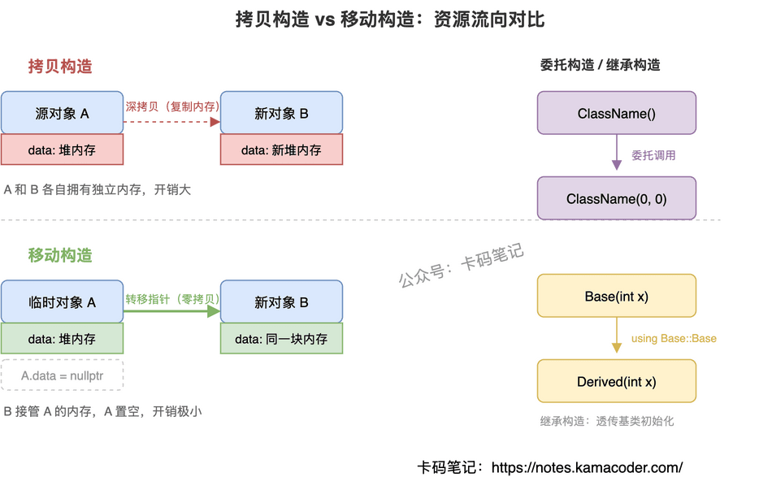
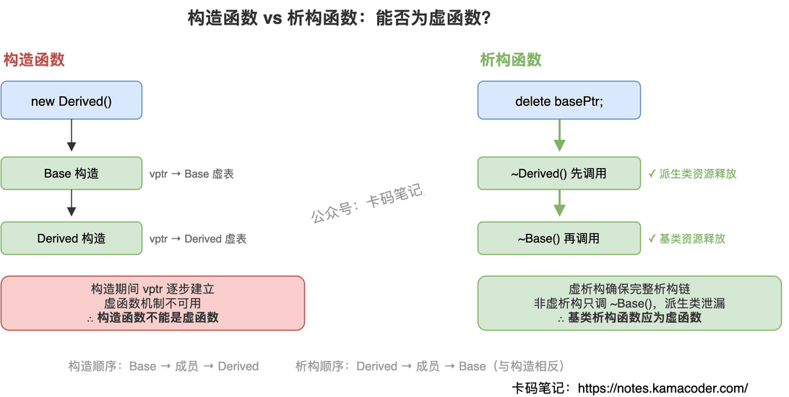
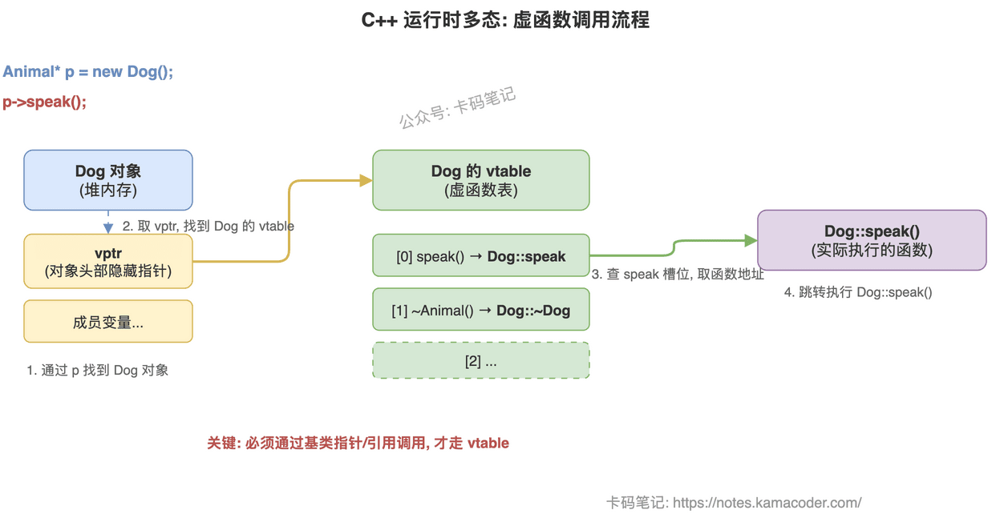
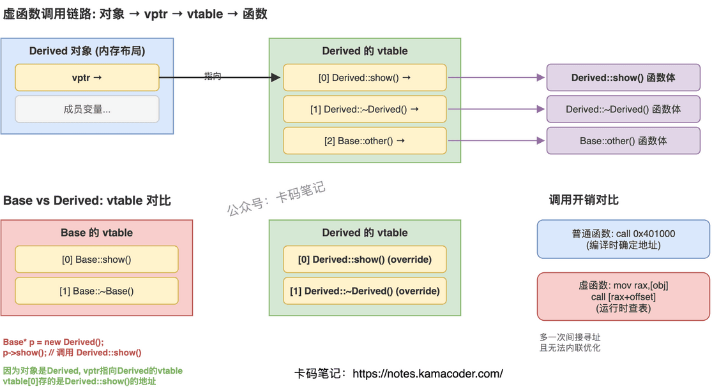
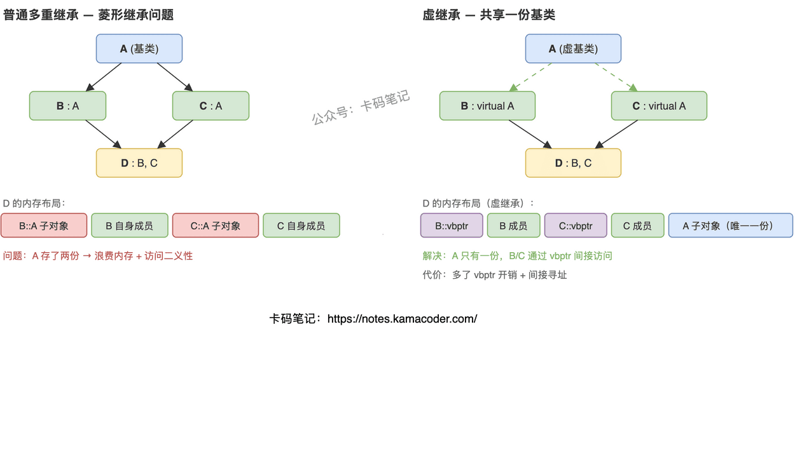
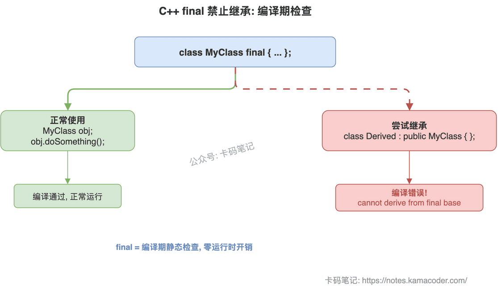
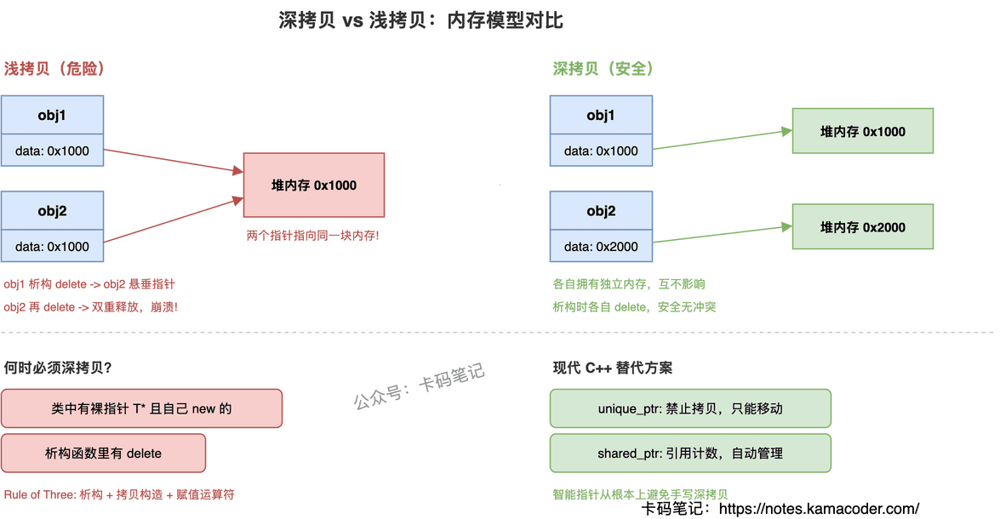
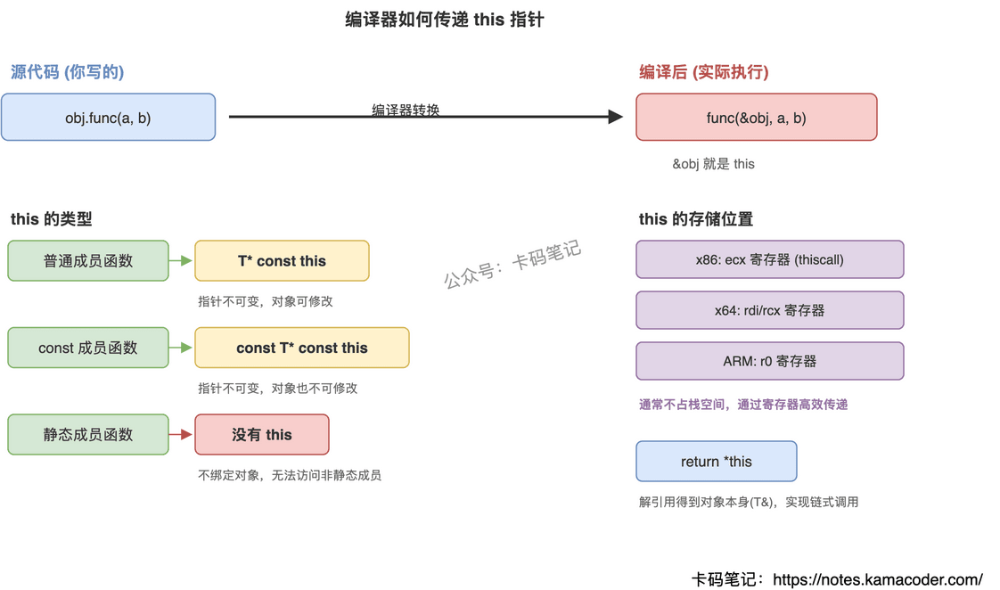
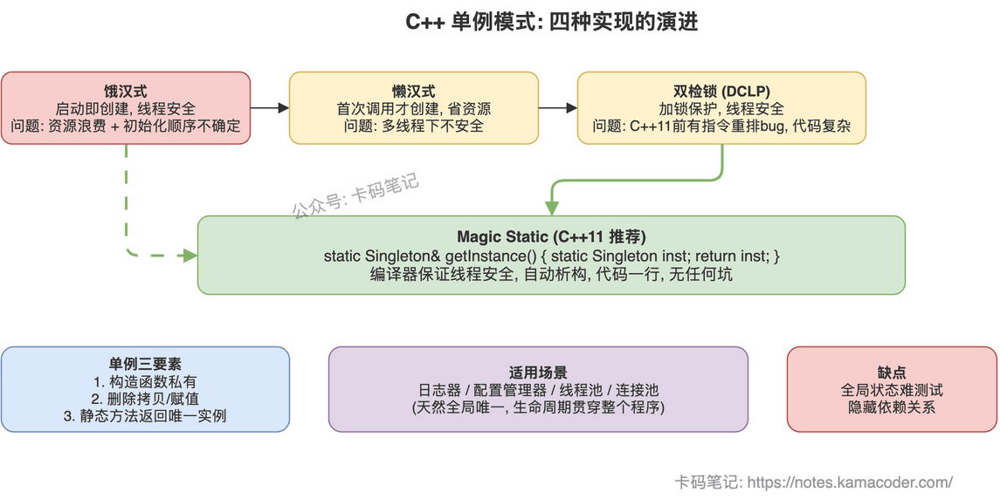

# 面向对象

## 1. C++构造函数的六种类型及作用

面试官问：”C++构造函数有几种？分别什么作用？”

这题考的是你对对象初始化机制的系统理解。很多人能说出默认构造和拷贝构造，但到移动构造、委托构造、继承构造就含糊了，更别说编译器什么时候自动生成、什么时候不生成。

### 简要回答

C++构造函数主要有**六种**：默认构造、参数化构造、拷贝构造、移动构造（C++11）、委托构造（C++11）、继承构造（C++11）。

核心区别在于**触发时机和资源处理方式**不同：默认构造负责零初始化，拷贝构造复制资源，移动构造转移资源所有权，委托构造复用初始化逻辑，继承构造透传基类初始化。

### 详细回答

| 类型 | 形式 | 作用 | 编译器自动生成？ |
| --- | --- | --- | --- |
| **默认构造** | `ClassName()` | 无参创建对象，默认初始化 | 未定义任何构造函数时自动生成；定义了其他构造函数后需 `= default` 显式声明 |
| **参数化构造** | `ClassName(int x, ...)` | 带参创建对象，指定初始化 | 不会自动生成 |
| **拷贝构造** | `ClassName(const ClassName&)` | 用已有对象初始化新对象（深/浅拷贝） | 未定义时自动生成（按成员浅拷贝） |
| **移动构造** | `ClassName(ClassName&&)` | 窃取临时对象资源，避免深拷贝开销 | 未定义拷贝/移动操作且未定义析构时自动生成 |
| **委托构造** | `ClassName() : ClassName(0,0) {}` | 一个构造函数调用同类其他构造函数，避免重复代码 | 不会自动生成 |
| **继承构造** | `using Base::Base;` | 派生类直接使用基类构造函数 | 不会自动生成，需 `using` 声明 |

前四种解决的是”怎么创建对象”，后两种解决的是”怎么复用初始化逻辑”。其中移动构造是 C++11 性能优化的核心手段，面试几乎必问。

### 知识拓展

面试官可能追问：

**Q1: 为什么需要移动构造函数？**

避免深拷贝临时对象的资源，直接”偷”过来。比如 `vector` 扩容时，移动构造比拷贝构造快得多，因为只转移指针而不复制整块内存。

**Q2: 拷贝构造函数参数为什么必须是 const 引用？**

如果是值传递，调用拷贝构造时又要拷贝实参，就无限递归了。加 const 是为了能接受常量对象和临时对象。

**Q3: 什么情况下编译器不会自动生成默认构造函数？**

只要你手动定义了任何一个构造函数，编译器就不再自动生成默认构造。想要的话得自己写 `ClassName() = default;`。

---

## 2. C++构造函数与析构函数能否为虚函数

面试官问："构造函数和析构函数可以是虚函数吗？为什么？"

这题看着基础，但很多人只能答出"构造函数不能、析构函数可以"就卡住了，说不清背后的原因——虚表指针在什么时候建立、不用虚析构会出什么问题。

### 简要回答

**构造函数不能是虚函数**，因为虚函数机制依赖于已构造的虚表指针，而构造期间 vptr 尚未就绪。

**析构函数可以且应该是虚函数**（基类场景下），确保通过基类指针删除派生类对象时能正确调用整个析构链，避免资源泄漏。

### 详细回答

|  | 构造函数 | 析构函数 |
| --- | --- | --- |
| **定义** | 与类同名，无返回类型，对象创建时自动调用 | 类名前加 `~`，无参数无返回类型，对象销毁时自动调用 |
| **能否为虚函数** | **不能** | **可以，且基类应该声明为虚函数** |
| **原因** | 构造期间 vptr 尚未建立，虚函数调用机制不起作用 | 不声明为虚函数，通过基类指针 `delete` 派生类对象时只调用基类析构，派生类资源泄漏 |
| **调用顺序** | 基类 → 成员 → 派生类 | 派生类 → 成员 → 基类（与构造相反） |
| **特殊情况** | 构造函数内调用虚函数会静态绑定到当前类版本，不会多态 | 纯虚析构函数可以使类成为抽象类，但必须提供实现体 |

总结一下：**构造时 vptr 还没准备好，所以构造函数不能虚；析构时如果不虚，多态删除就会漏掉派生类的清理。**

### 知识拓展

面试官可能追问：

**Q1: 什么情况下必须使用虚析构函数？**

当类可能被继承，且可能通过基类指针删除派生类对象时。只要你的类设计为基类，析构函数就应该是虚的。

**Q2: 构造函数中调用虚函数会怎样？**

技术上能编译通过，但不会多态——只会调用当前正在构造的那个类的版本，因为此时派生类部分还没构造完，vptr 指向的是当前类的虚表。

**Q3: 析构函数中抛出异常会怎样？**

非常危险。如果析构是在栈展开（处理另一个异常）过程中被调用的，再抛异常会直接 `std::terminate`，程序终止。所以析构函数里应该吞掉所有异常。

---

## 3. 重载和重写的区别

面试官问"重载和重写有什么区别"，大部分人能说出"重载参数不同，重写是子类覆盖父类"，但追问"重载能不能靠返回值区分""不加 virtual 会怎样""override 关键字到底有什么用"就开始含糊了。这道题的核心是理解：重载是编译期决定调哪个（静态绑定），重写是运行时决定调哪个（动态绑定）。

### 简要回答

重载（Overload）是在同一个作用域里，多个函数名字相同但参数列表不同（类型不同、个数不同、顺序不同），编译器在编译时根据你传的参数类型决定调用哪个版本。重写（Override）是子类对父类虚函数的重新实现，函数名、参数、返回值完全一样，运行时通过虚函数表决定调用父类版本还是子类版本。一个是编译期多态，一个是运行时多态。

### 详细回答

**重载发生在什么条件下**

重载发生在同一个作用域内（同一个类里，或者同一个命名空间里）。条件是函数名相同，但参数列表必须不同——可以是参数类型不同、参数个数不同、或者参数顺序不同。编译器通过参数列表来区分调用哪个函数，这个过程在编译期就确定了，叫静态绑定。注意：**不能仅靠返回值类型来区分重载**，因为调用时编译器看不到你要用返回值做什么，无法判断该调哪个。

**重写发生在什么条件下**

重写必须满足三个前提：有继承关系、父类函数标了 `virtual`、子类函数签名和父类完全一致（函数名、参数列表、const 修饰都一样）。满足这三个条件后，通过父类指针/引用调用该函数时，运行时会根据对象的实际类型（通过虚函数表查找）决定调用父类版本还是子类版本，这就是动态绑定。

**virtual 和 override 各自的作用**

`virtual` 写在父类函数声明前面，告诉编译器"这个函数可能被子类重写，请走虚函数表机制"。如果父类不加 `virtual`，子类写了同名同参的函数不叫重写，叫"隐藏"（hiding）——通过父类指针调用时永远调父类版本，多态失效。

`override` 写在子类函数声明后面（C++11 引入），告诉编译器"我打算重写父类的虚函数，请帮我检查签名是否匹配"。如果你不小心写错了参数类型或者拼错了函数名，编译器会直接报错。不加 `override` 也能重写成功，但加了更安全，属于防御性编程。

**不加 virtual 会怎样**

如果父类函数没有 `virtual`，子类定义了同名同参的函数，这不是重写而是隐藏。通过父类指针调用时，永远调父类版本；只有通过子类指针/对象直接调用时才会调子类版本。这是面试中最常见的坑——很多人以为只要子类写了同名函数就是重写，实际上没有 `virtual` 就没有多态。

### 知识拓展

**Q：重载能不能靠返回值来区分？**

不能。C++ 标准规定重载只看参数列表，不看返回值。原因很简单：调用 `func(1)` 时，编译器能看到参数是 `int`，但看不到你要把返回值赋给什么类型的变量（甚至可能不用返回值），所以无法靠返回值区分。

**Q：重写的返回值必须完全一样吗？**

有一个例外叫"协变返回类型"（covariant return type）：如果父类虚函数返回 `Base*`，子类重写时可以返回 `Derived*`（Derived 是 Base 的子类）。除此之外返回值必须完全一致。

**Q：重载和重写能同时存在吗？**

能。一个类里可以有多个同名函数（重载），其中某个版本是从父类继承来的虚函数被重写了。重载和重写是两个维度的概念，不冲突。

**Q：还有个"隐藏"（hiding）是什么？**

子类定义了和父类同名的函数（不管参数是否相同），如果父类函数不是虚函数，或者参数列表不同，就会把父类的同名函数"隐藏"掉。通过子类对象调用时只能看到子类版本，父类版本被遮蔽了。这和重写不同——重写是多态机制，隐藏不是。

---

## 4. C++多态的实现机制

面试官问"C++多态是怎么实现的"，很多人只答"虚函数+继承"就停了。但面试官真正想听的是**底层怎么走的**——vtable 在哪、vptr 什么时候初始化、调用链是怎样的。只说表面概念，面试官一定会追问到你答不上来。

把编译时多态和运行时多态分清楚，再把运行时多态的调用链讲明白，这道题就稳了。

### 简要回答

C++ 多态分两种：**编译时多态**靠函数重载和模板，编译期就确定调用谁；**运行时多态**靠 virtual 函数 + 继承 + 基类指针/引用，运行时通过 vptr → vtable → 函数地址 动态绑定到正确的实现。

### 详细回答

| 维度 | 编译时多态 | 运行时多态 |
| --- | --- | --- |
| 实现手段 | 函数重载、模板 | 虚函数 + 继承 |
| 绑定时机 | 编译期（静态绑定） | 运行期（动态绑定） |
| 关键机制 | 编译器根据参数类型/模板参数选择 | vptr → vtable → 函数地址 |
| 触发条件 | 直接调用即可 | 必须通过**基类指针或引用**调用 |
| 性能 | 无额外开销，可内联 | 多一次间接寻址，无法内联 |
| 典型场景 | `sort` 的比较函数、`max<T>` | 基类接口统一调度派生类行为 |

**运行时多态的三个必要条件**：基类声明 `virtual` 函数、派生类重写（override）该函数、通过基类指针或引用调用。三者缺一不可——如果用派生类对象直接调用，编译器会静态绑定，不走 vtable。

**虚函数调用的底层流程**（以 `Animal* p = new Dog(); p->speak();` 为例）：

1. 编译器为每个含虚函数的类生成一张 **vtable**，表中按声明顺序存放虚函数地址。Dog 的 vtable 中 `speak` 槽位存的是 `Dog::speak` 的地址
2. 每个对象的内存布局最前面藏一个 **vptr**，构造时指向本类的 vtable
3. 调用 `p->speak()` 时：通过 p 找到 Dog 对象 → 取 vptr → 在 vtable 中查 `speak` 的偏移 → 跳转执行 `Dog::speak()`

这就是为什么基类析构函数必须声明为 virtual——否则 `delete p` 时只调基类析构，派生类资源泄漏。

### 知识拓展

**Q：抽象类和纯虚函数是什么关系？**

含有纯虚函数（`virtual void run() = 0;`）的类就是抽象类，不能实例化，只能被继承。派生类必须实现所有纯虚函数才能实例化，相当于强制定义接口规范。

**Q：override 和 final 分别干什么？**

`override` 让编译器检查你是否真的重写了基类虚函数，写错函数签名会直接报错，防止"以为重写了其实没有"的 bug。`final` 禁止派生类继续重写某个虚函数，或者禁止某个类被继承。

**Q：虚函数调用比普通函数慢多少？**

多一次指针间接寻址（取 vptr + 查 vtable），在现代 CPU 上通常只差几纳秒。真正的性能损失不在寻址本身，而在于虚函数调用无法被内联优化。热路径上如果频繁调用小虚函数，可以考虑 CRTP（静态多态）替代。

**Q：构造函数里能调虚函数吗？**

能调，但不会多态。构造函数执行时 vptr 指向的是当前正在构造的类的 vtable，不是最终派生类的。所以在基类构造函数里调虚函数，调的是基类版本，不是派生类版本。

---

## 5. 虚函数和纯虚函数有什么区别

面试官问："虚函数和纯虚函数有什么区别？什么时候用虚函数，什么时候用纯虚函数？"

这题看着简单，但很多人只能答出"纯虚函数后面加=0"就卡住了，说不清两者在设计意图上的本质差异，也答不上纯虚函数能不能有实现体这种追问。

### 简要回答

虚函数用`virtual`声明，**有默认实现**，派生类**可以选择性重写**，类**可以实例化**。纯虚函数在声明后加`= 0`，**没有默认实现**，派生类**必须重写**，类**不能实例化**（成为抽象类）。

一句话：虚函数是"我有默认行为，你可以改"；纯虚函数是"我只定规范，你必须自己实现"。

### 详细回答

**虚函数：提供默认行为，允许覆盖**

用`virtual`声明后，通过基类指针/引用调用时走动态绑定，运行时根据对象实际类型决定调哪个版本。派生类可以override也可以不override，不override就用基类的默认实现。类本身可以正常实例化。

**纯虚函数：定义接口，强制实现**

声明时加`= 0`，告诉编译器"这个函数没有默认实现，派生类必须自己写"。包含纯虚函数的类自动变成抽象类，不能直接`new`出来。设计意图是定义接口规范——基类只规定"要做什么"，具体"怎么做"由派生类决定。

**核心区别**

| 维度 | 虚函数 | 纯虚函数 |
| --- | --- | --- |
| 声明 | `virtual void f() {}` | `virtual void f() = 0;` |
| 默认实现 | 有，派生类可不重写 | 无，派生类必须重写 |
| 类能否实例化 | 能 | 不能（抽象类） |
| 设计意图 | 提供默认行为，允许定制 | 定义接口规范，强制实现 |
| 典型场景 | 大多数派生类行为相同，少数需要定制 | 每个派生类行为都不同 |

### 知识拓展

面试官可能追问：

**Q1: 构造函数能不能是虚函数？**

不能。虚函数调用依赖vptr，而vptr是在构造函数里才被设置的。构造函数的工作是"把对象建出来"，虚函数机制需要"对象已经存在"，顺序矛盾。

**Q2: 纯虚函数能不能有实现体？**

能。语法上`= 0`只是说"派生类必须重写"，不是说"基类不能提供实现"。基类可以在类外给纯虚函数写实现体，派生类通过`Base::f()`显式调用。典型用途是提供一个"默认实现"让派生类选择性复用。

**Q3: override和final分别解决什么问题？**

`override`让编译器检查你是不是真的重写了基类虚函数，防止函数签名写错了却不报错。`final`禁止派生类再重写某个虚函数，或者禁止整个类被继承。两个都是C++11加的，属于编译期安全检查。

**Q4: 什么时候该用纯虚函数？**

当基类只规定"要做什么"但不知道"怎么做"时。比如定义一个`Shape`基类，`draw()`每个形状画法都不同，没有合理的默认实现，就该用纯虚函数。如果大多数派生类行为相同只有少数需要定制，用普通虚函数给个默认实现更合适。

---

## 6. 虚函数的实现机制

面试官问："虚函数是怎么实现的？调用一个虚函数的时候底层发生了什么？"

这题考的不是"什么是多态"，而是多态背后的实现细节。很多人能说出"虚函数表"三个字就卡住了，说不清vtable在哪、vptr什么时候初始化、调用链路是怎么走的。把这条链路讲清楚，这题就拿满分。

### 简要回答

编译器为每个含虚函数的类生成一张**虚函数表（vtable）**，表里存的是该类各虚函数的地址。每个对象内部有一个隐藏的**虚指针（vptr）**，指向所属类的vtable。通过基类指针调用虚函数时，运行时沿着 `对象 → vptr → vtable → 函数地址` 这条链路找到真正要调用的函数，这就是**动态绑定**。

### 详细回答

**vtable：每个类一张表**

编译器看到一个类里有`virtual`函数，就会为这个类生成一张vtable。表里按声明顺序存放各虚函数的地址。派生类如果override了某个虚函数，它的vtable里对应位置就换成自己的函数地址；没override的槽位继续指向基类版本。

**vptr：每个对象一个指针**

每个含虚函数的对象，内存布局里都多一个隐藏成员——vptr。构造函数执行时，编译器自动把vptr设置为指向当前类的vtable。所以`Base* p = new Derived()`，p指向的对象里的vptr指向的是Derived的vtable，不是Base的。

**调用链路**

`p->show()` 在底层展开为：取对象的vptr → 在vtable中按偏移找到`show`的地址 → 跳转调用。整个过程多了一次指针解引用（间接寻址），这就是虚函数比普通函数调用慢一点的原因。

核心就一句话：**vtable让"调哪个函数"变成了运行时查表，而不是编译时写死。**

### 知识拓展

面试官可能追问：

**Q1: vptr放在对象的什么位置？**

主流实现（GCC/Clang/MSVC）都把vptr放在对象内存的最前面，这样通过对象首地址就能直接拿到vptr，不需要额外偏移计算。

**Q2: 多继承时vtable怎么处理？**

多继承时一个对象可能有多个vptr，每条继承链一个，对应多张vtable。通过不同基类指针调用虚函数时，走的是不同的vptr和vtable。

**Q3: 虚函数调用比普通函数慢多少？**

多一次指针解引用，通常就是一条`mov`加一条间接`call`的开销。现代CPU有分支预测和缓存，实际性能差距很小。真正的代价是编译器无法内联虚函数调用，丧失了内联优化的机会。

**Q4: 为什么基类析构函数要声明为virtual？**

`delete basePtr`时，如果析构函数不是virtual，只会调用基类的析构函数，派生类的析构不会执行，派生类申请的资源就泄漏了。声明为virtual后，析构也走vtable查表，能正确调到派生类析构。

---

## 7. 多重继承的优缺点及菱形继承问题

面试官问"多重继承有什么问题，菱形继承怎么解决"，大部分人能说出"虚继承"三个字，但追问"虚继承的内存布局是什么样的""为什么虚基类要由最派生类初始化""什么时候该用多重继承什么时候该用组合"就答不上来了。这道题的核心是理解菱形继承在内存层面到底出了什么问题。

### 简要回答

多重继承让一个类同时继承多个基类，好处是能组合多个接口、复用多个类的功能。坏处是当多个基类有同名成员时产生二义性，更严重的是菱形继承——`D` 同时继承 `B` 和 `C`，而 `B` 和 `C` 都继承自 `A`，导致 `D` 里面有两份 `A` 的子对象，访问 `A` 的成员不知道该用哪份。C++ 用虚继承解决：`B` 和 `C` 虚继承 `A`，编译器保证 `D` 里只有一份 `A`，通过虚基类指针间接访问。

### 详细回答

**菱形继承到底出了什么问题**

普通多重继承下，`D` 的对象内存里包含一个完整的 `B` 子对象和一个完整的 `C` 子对象。而 `B` 里有一份 `A`，`C` 里也有一份 `A`——所以 `D` 里有两份 `A`。这带来两个问题：一是浪费内存（`A` 的数据存了两份），二是访问 `A` 的成员时编译器不知道该用 `B` 路径的那份还是 `C` 路径的那份，产生二义性，必须用 `d.B::name` 或 `d.C::name` 显式指定。

**虚继承怎么解决的**

`B` 和 `C` 用 `virtual public A` 继承时，编译器不再把 `A` 的子对象直接嵌入 `B` 和 `C` 内部，而是在 `B` 和 `C` 里各放一个虚基类指针（vbptr），指向虚基类表（vbtable），表里记录了 `A` 子对象相对于当前对象的偏移量。最终 `D` 的内存布局里只有一份 `A`，`B` 和 `C` 通过各自的 vbptr 间接访问这份共享的 `A`。

代价是：访问虚基类成员多了一次间接寻址（通过 vbptr 查表算偏移），对象体积也多了 vbptr 的开销。

**为什么虚基类要由最派生类初始化**

普通继承下，`B` 的构造函数负责初始化它的 `A` 子对象。但虚继承下 `A` 只有一份，如果 `B` 和 `C` 都去初始化就冲突了。所以 C++ 规定：虚基类由最派生类（`D`）的构造函数直接初始化，`B` 和 `C` 构造函数里对 `A` 的初始化会被忽略。

### 知识拓展

**Q：什么时候该用多重继承，什么时候该用组合？**

多重继承适合"接口组合"场景——多个基类都是纯虚接口（没有数据成员），派生类实现多个接口。如果基类有数据成员和实现逻辑，优先用组合（把基类作为成员变量），避免菱形继承和内存布局复杂化。经验法则：继承表达"is-a"关系，组合表达"has-a"关系。

**Q：名称冲突怎么解决？**

用作用域解析运算符显式指定：`d.B::func()` 或 `d.C::func()`。或者在派生类里重写同名函数，内部决定调用哪个基类版本。

**Q：多重继承时析构函数要注意什么？**

基类析构函数必须声明为 `virtual`，否则通过基类指针 `delete` 派生类对象时不会调用派生类析构函数，导致资源泄漏。编译器会按继承声明的逆序自动调用各基类析构函数，不需要手动调用。

**Q：Java/Go 为什么不支持多重继承？**

Java 用接口（interface）代替多重继承——一个类可以实现多个接口但只能继承一个类，从语言层面避免了菱形继承问题。Go 用组合+接口的方式，完全没有继承概念。C++ 保留多重继承是为了灵活性，但实际工程中建议只在接口组合场景使用。

---

## 8. C++如何禁止一个类被继承

面试官问"怎么禁止一个类被继承"，大多数人能答出 `final`，但接着追问"final 除了禁止继承还能干什么""为什么要禁止继承""C++11 之前怎么做的"，就开始含糊了。

这道题考的不只是语法，而是你对面向对象设计原则的理解——什么时候该用继承，什么时候该禁止继承。

### 简要回答

C++11 起，直接用 **`final`** 修饰类即可：`class MyClass final { ... };`。编译器在解析继承关系时发现目标是 final 类，直接报错，零运行时开销。C++11 之前需要用**私有构造函数 + 虚继承 + 友元**的组合 hack，复杂且已被淘汰。

### 详细回答

**final 的两种用法**

第一种是修饰类：`class MyClass final { ... };`，禁止任何类继承它。第二种是修饰虚函数：`void speak() final;`，禁止派生类重写这个虚函数。两者都是编译期静态检查，不产生运行时开销。

**底层原理很简单**——编译器在解析继承关系或虚函数重写时，检查目标是否标记了 final。如果是，直接报编译错误 `cannot derive from 'final' base` 或 `cannot override 'final' function`，不需要任何运行时机制。

**C++11 之前的替代方案**（了解即可，不推荐使用）

核心思路是利用虚继承的一个特性：虚继承要求**最终派生类**直接调用虚基类的构造函数。具体做法是定义一个辅助类 `MakeFinal`，把构造函数设为 private，然后让目标类虚继承它并声明为友元。这样目标类自己能构造（因为是友元），但如果有人试图继承目标类，最终派生类需要直接调用 `MakeFinal` 的私有构造函数，访问不到就报错了。

这个方案依赖复杂的继承关系和访问控制，可读性差、维护成本高，现在完全没必要用了。

### 知识拓展

**Q：final 在性能上有什么好处？**

编译器知道一个类是 final 或者一个虚函数是 final 后，可以做\*\*去虚拟化（devirtualization）\*\*优化。因为不可能有派生类重写这个函数，编译器可以在编译期确定调用目标，把虚函数调用（通过 vptr 间接跳转）优化成直接调用甚至内联。热路径上频繁调用的虚函数加 final 能有明显性能提升。

**Q：什么场景下应该禁止继承？**

工具类（只有静态方法，没有状态，继承没意义）、策略类（通过组合使用而非继承）、资源句柄类（如 `FileDescriptor`，继承可能破坏 RAII 语义）、性能关键类（加 final 帮助编译器优化）。核心原则是**组合优于继承**——如果一个类的设计意图是被组合使用而非被继承扩展，就应该加 final 明确表达这个意图。

**Q：final 和 override 有什么关系？**

两者都是 C++11 引入的上下文关键字，配合虚函数使用。`override` 告诉编译器"我确实在重写基类虚函数"，写错签名会报错，防止隐式隐藏。`final` 告诉编译器"到此为止，不允许再重写"。两者可以同时使用：`void speak() override final;` 表示"我重写了基类的 speak，并且禁止后续派生类再重写它"。

---

## 9. 深拷贝与浅拷贝

面试官问："深拷贝和浅拷贝有什么区别？什么时候必须用深拷贝？"

这题看起来简单，但很多人只能说出"浅拷贝复制指针，深拷贝复制内容"，问到内存模型层面的原因、什么场景会出问题、怎么和智能指针配合，就答不上来了。关键是从**内存布局**的角度理解两者的本质差异。

### 简要回答

浅拷贝：只复制对象的成员变量值。对于指针成员，复制的是**地址本身**，两个对象的指针指向同一块堆内存。

深拷贝：为指针成员**重新分配内存并复制内容**，两个对象各自拥有独立的堆内存，互不影响。

核心问题：浅拷贝导致两个对象共享同一块堆内存，任何一个对象析构时 `delete` 这块内存，另一个对象的指针就变成悬垂指针——再次 `delete` 就是双重释放，程序崩溃。

### 详细回答

**编译器默认生成的拷贝构造函数是浅拷贝**

编译器自动生成的拷贝构造函数和赋值运算符，做的是逐成员复制（memberwise copy）。对于 `int`、`double` 这些值类型没问题，但对于指针成员，复制的只是地址值——两个对象的指针指向同一块内存。

**浅拷贝的致命问题**

当类管理动态内存（`new` 出来的资源）时，浅拷贝会导致：

- **双重释放**：两个对象析构时都 `delete` 同一块内存，程序崩溃
- **悬垂指针**：一个对象析构后，另一个对象的指针指向已释放的内存，访问就是未定义行为
- **意外修改**：通过一个对象修改数据，另一个对象的数据也被改了

**深拷贝的实现**

当类包含指针成员且管理动态内存时，必须手动实现：拷贝构造函数、赋值运算符、析构函数——这就是 C++ 的 **Rule of Three**。拷贝构造和赋值运算符中，为指针成员 `new` 新内存，把原对象指向的内容复制过来。这样两个对象各自拥有独立的内存，析构时各自释放，互不干扰。

**现代 C++ 的替代方案**

C++11 之后，用 `unique_ptr` 或 `shared_ptr` 管理动态内存，可以避免手写深拷贝。`unique_ptr` 禁止拷贝（只能移动），从根本上避免共享问题；`shared_ptr` 用引用计数自动管理生命周期，多个对象可以安全共享同一块内存。

### 知识拓展

面试官可能追问：

**Q1: 什么时候必须写深拷贝？**

只要类里有裸指针（`T*`）并且这个指针指向的内存是类自己 `new` 出来的，就必须写深拷贝。判断标准很简单：如果你写了析构函数里有 `delete`，那就一定要写拷贝构造和赋值运算符（Rule of Three）。如果类里只有值类型成员或者智能指针，编译器默认的浅拷贝就够用。

**Q2: STL 容器存自定义对象时，拷贝语义有什么坑？**

STL 容器是值语义，`push_back` 会触发拷贝构造。如果你的类有裸指针但没写深拷贝，容器里的对象和外面的对象共享内存，容器扩容时旧元素析构会释放内存，新元素的指针就悬空了——直接崩溃。解决方案：要么实现深拷贝，要么用智能指针管理资源，要么存指针而不是对象。

**Q3: 写时复制（COW）是什么？和深拷贝什么关系？**

写时复制是一种优化策略：拷贝时先做浅拷贝（共享内存），只有当某个对象要修改数据时，才真正做深拷贝。用引用计数跟踪有多少对象共享同一块内存，修改前检查计数——如果大于 1，先复制一份再改。早期的 `std::string` 实现就用了 COW，但因为多线程下引用计数的原子操作开销太大，C++11 之后标准库不再使用这种策略。

**Q4: 移动语义和深拷贝是什么关系？**

移动语义是 C++11 引入的第三种选择——既不是浅拷贝（共享资源），也不是深拷贝（复制资源），而是**转移资源所有权**。移动构造函数把源对象的指针"偷过来"，然后把源对象的指针置空。代价从 O(n) 的深拷贝降到 O(1) 的指针赋值。当你不再需要源对象时（比如函数返回临时对象），移动比深拷贝高效得多。

---

## 10. this 指针的原理

面试官问"this 指针是什么"，大多数人能答出"指向当前对象的指针"。但追问"this 存在哪里""编译器怎么传递 this""const 成员函数里 this 是什么类型""this 能为空吗"就容易卡住了。关键是理解 this 不是什么神秘的东西——它就是编译器自动传入的第一个参数。

### 简要回答

this 是编译器隐式传给每个非静态成员函数的第一个参数，类型是 `T* const`（指针本身不可变，指向的对象可变）。调用 `obj.func(x)` 时，编译器实际生成的是 `func(&obj, x)`，把对象地址作为第一个实参传入。this 通常通过寄存器传递（x86 用 ecx，即 thiscall 约定），不占栈空间。const 成员函数中 this 类型变为 `const T* const`，所以不能修改成员。静态成员函数没有 this，因为它不绑定任何对象实例。

### 详细回答

**编译器的转换——this 的本质**

C++ 的成员函数调用在编译后和普通函数没有区别。编译器把 `obj.func(a, b)` 转换成类似 `func(&obj, a, b)` 的形式，对象地址作为隐含的第一个参数传入，这个参数就是 this。所以 this 不是存储在对象里的，也不是什么特殊的运行时机制——它就是一个函数参数。

**this 的类型**

普通成员函数中，this 的类型是 `T* const`：指针本身是常量（不能让 this 指向别的对象），但指向的对象不是常量（可以修改成员）。const 成员函数中，this 变成 `const T* const`：指针本身不可变，指向的对象也不可变，所以不能通过 this 修改任何非 mutable 成员。

**this 的存储位置**

this 是函数参数，具体存在哪取决于调用约定。x86 平台的 thiscall 约定中，this 通过 ecx 寄存器传递，不占栈空间。x64 和 ARM 平台也通常用寄存器传递前几个参数。只有在函数内部需要取 this 的地址时，编译器才会把它溢出到栈上。

**静态成员函数为什么没有 this**

静态成员函数属于类而不属于任何对象实例，调用时不需要对象（`T::staticFunc()`），编译器不会传入对象地址，所以没有 this。这也是静态函数不能访问非静态成员的根本原因——没有对象地址，无法定位成员的内存位置。

### 知识拓展

**Q：`return *this` 是什么意思？**

解引用 this 得到当前对象本身（类型是 `T&`），返回它就是返回对象的引用。链式调用 `obj.set(1).set(2).set(3)` 就是靠每个方法 `return *this` 实现的——每次返回的都是同一个对象的引用，所以可以继续调用它的方法。

**Q：this 能为 nullptr 吗？**

语法上可以构造出来（`((T*)nullptr)->func()`），但这是未定义行为。如果 func 内部不访问任何成员变量，某些编译器下可能不崩溃，但这纯属巧合，不能依赖。任何通过空 this 访问成员的操作都会段错误。

**Q：this 和智能指针有什么关系？**

this 是裸指针，不管理生命周期。如果需要在对象内部获取指向自身的 `shared_ptr`，不能直接 `shared_ptr<T>(this)`（会导致双重释放），必须继承 `std::enable_shared_from_this<T>`，然后调用 `shared_from_this()`。

**Q：为什么不能在构造函数里调用虚函数并期望多态？**

构造函数执行时，对象的动态类型还是当前正在构造的类（vptr 指向当前类的 vtable），this 的静态类型也是当前类。所以即使调用虚函数，也只会调到当前类的版本，不会调到派生类的重写版本。

---

## 11. C++ 单例模式的实现

面试官问"怎么实现单例模式"，大多数人能写出懒汉式，但追问"线程安全吗""双检锁有什么坑""现代 C++ 推荐哪种"，就开始含糊了。

这道题考的不是能不能写出代码，而是你对四种实现方式的**演进逻辑**和**各自的坑**是否清楚。把"为什么一步步演进到 Magic Static"讲清楚，面试官就不会继续追了。

### 简要回答

单例模式确保**类只有一个实例 + 提供全局访问点**。核心手段：构造函数私有化 + 删除拷贝/赋值 + 静态方法返回唯一实例。现代 C++ 推荐用**局部静态变量（Magic Static）**：`static Singleton& getInstance() { static Singleton inst; return inst; }`——C++11 标准保证局部 static 变量初始化是线程安全的，代码最简洁，自动析构，没有任何坑。

### 详细回答

**四种实现的演进逻辑**

**饿汉式**：程序启动时就创建实例（静态成员变量在 main 之前初始化）。天然线程安全，但如果单例很重且可能用不到，就浪费了资源。另外多个饿汉式单例之间的初始化顺序不确定（static initialization order fiasco）。

**懒汉式**：第一次调用 `getInstance()` 时才创建。解决了资源浪费问题，但多线程下两个线程同时判断 `instance == nullptr` 会创建两个实例——线程不安全。

**双检锁（DCLP）**：在懒汉式基础上加锁。第一次检查避免每次都加锁（性能），加锁后第二次检查避免重复创建。但在 C++11 之前，由于指令重排和内存可见性问题，DCLP 实际上是有 bug 的。C++11 之后需要配合 `std::atomic` 或 `std::call_once` 才能正确实现。

**Magic Static（C++11 推荐）**：函数内的局部 static 变量，C++11 标准规定其初始化必须是线程安全的（编译器负责加锁）。代码只需一行，没有手动锁、没有指针、没有内存泄漏（程序结束时自动析构）。这是现代 C++ 的标准答案。

**为什么 Magic Static 是最优解**

线程安全由编译器保证，不需要程序员操心。返回引用而非指针，不存在 `delete` 的问题。程序结束时自动调用析构函数，资源正确释放。代码极简，不容易写错。唯一的"缺点"是不能控制销毁顺序——但绝大多数场景不需要。

### 知识拓展

**Q：单例模式有什么缺点？什么时候不该用？**

单例本质是全局状态，会导致：单元测试困难（全局状态难隔离）、隐藏依赖关系（调用方看不出依赖了单例）、违反单一职责（既管业务又管自己的生命周期）。如果可以用依赖注入替代，优先不用单例。真正适合的场景：日志器、配置管理器、线程池、连接池——这些天然是全局唯一且生命周期贯穿整个程序的。

**Q：双检锁在 C++11 之前为什么有 bug？**

`instance = new Singleton()` 这一行实际上分三步：分配内存、调用构造函数、赋值指针。编译器/CPU 可能重排为：分配内存→赋值指针→调用构造函数。这时另一个线程看到 `instance != nullptr` 就直接返回了，但对象还没构造完——未定义行为。C++11 的 `std::atomic` 和内存序解决了这个问题，但代码很复杂，不如直接用 Magic Static。

**Q：饿汉式的初始化顺序问题是什么？**

如果单例 A 的构造函数里用到了单例 B，而 B 还没初始化（不同编译单元的 static 变量初始化顺序未定义），就会崩溃。Magic Static 天然避免了这个问题——谁先被调用谁先初始化，顺序由调用链决定。

**Q：单例怎么正确销毁？**

Magic Static 方式程序结束时自动析构，不需要手动管理。如果用指针式（饿汉/懒汉/双检锁），需要额外的销毁机制（如 `atexit` 注册回调），否则内存泄漏。这也是推荐 Magic Static 的原因之一。

---
