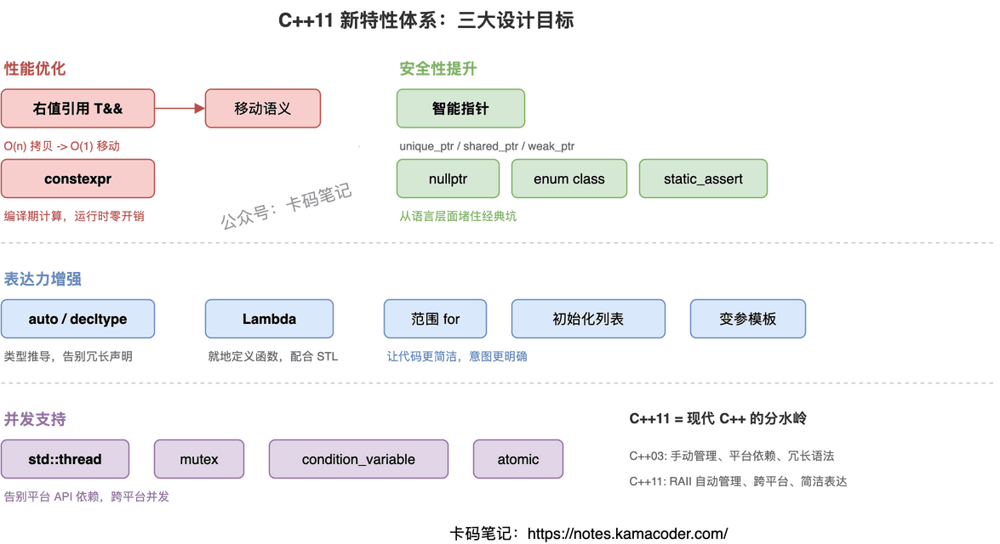
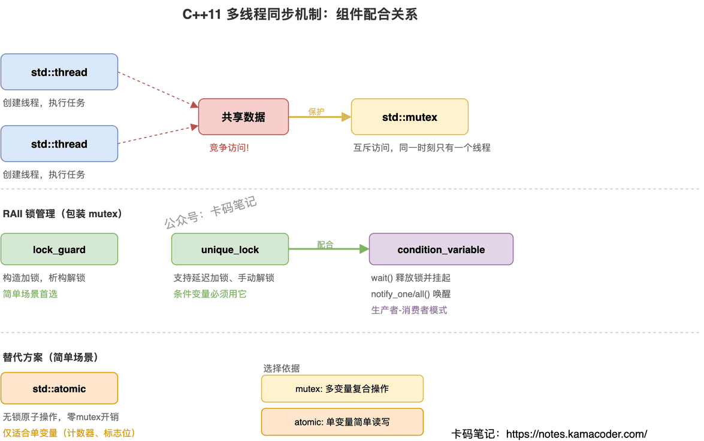
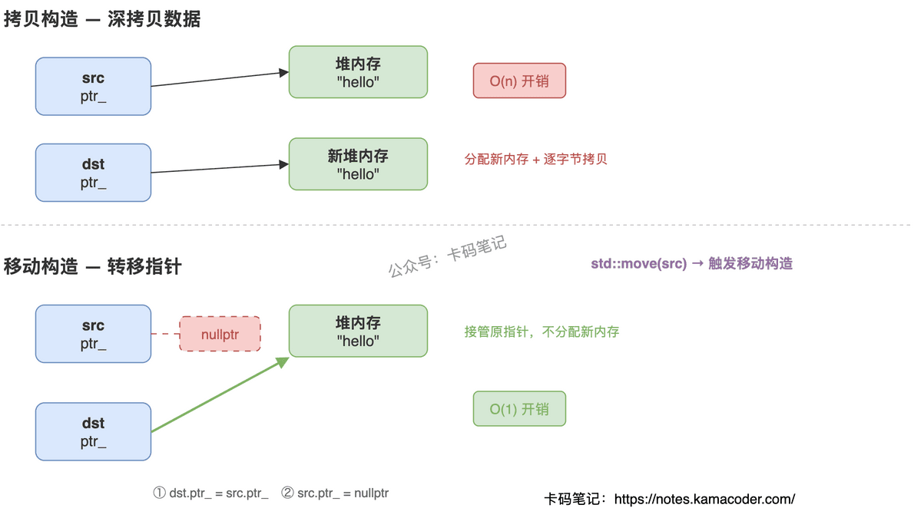
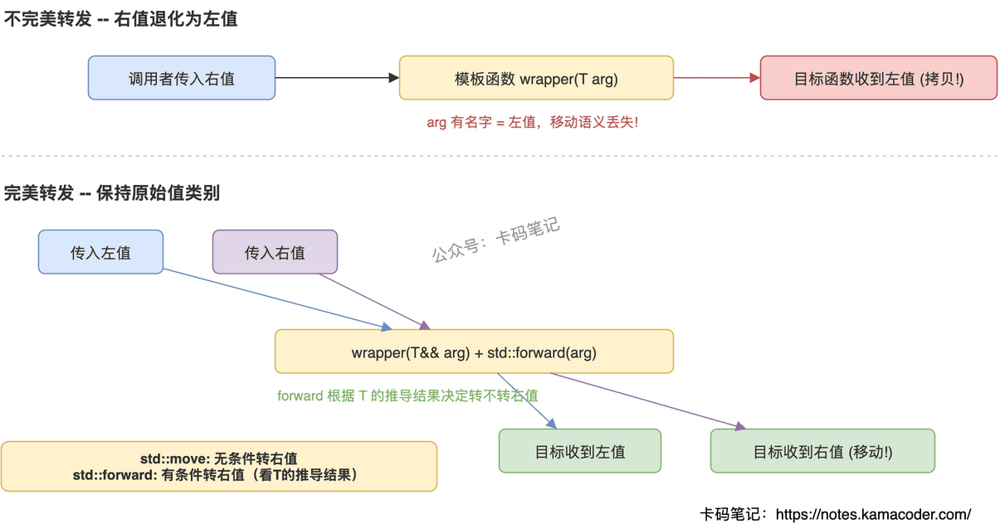
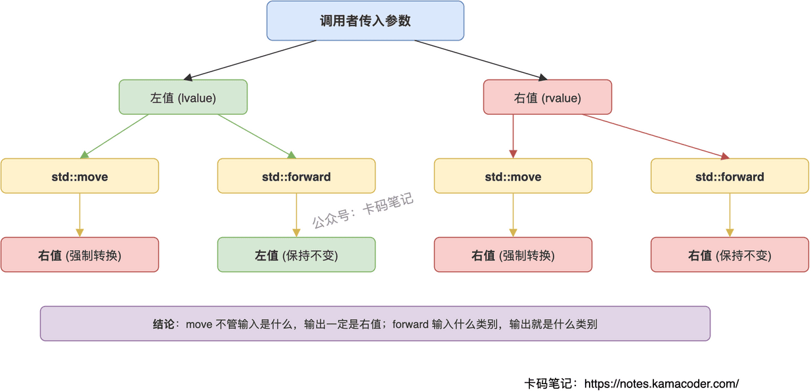
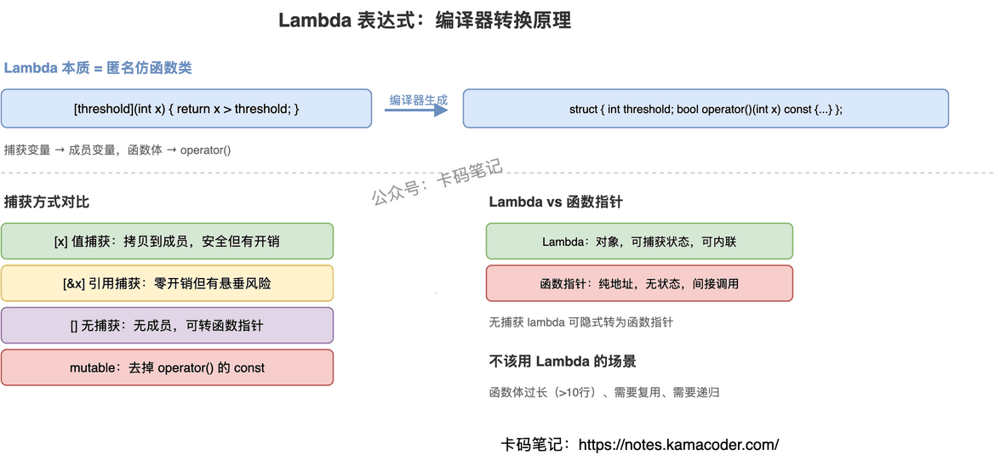
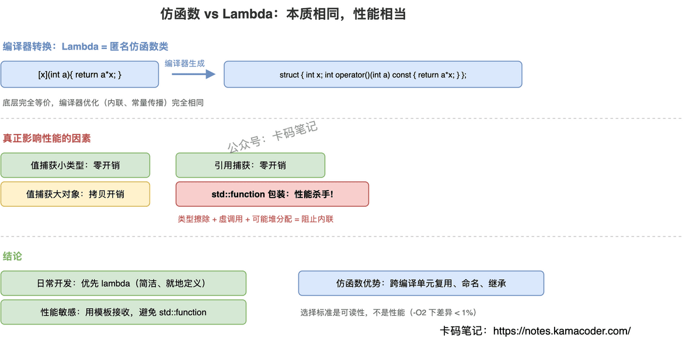

## 1. C++11 新特性全景

面试官问："C++11 有哪些重要的新特性？你觉得最核心的改进是什么？"

这题看似简单，实际上考的是你对 C++11 的理解深度。很多人能列出十几个特性名字，但说不清这些特性之间的关系、为什么要引入、解决了什么问题。关键是从**设计动机**出发，把零散的特性串成体系。

### 简要回答

C++11 是现代 C++ 的分水岭，所有新特性围绕三个核心目标展开：

- **性能优化**：右值引用、移动语义、constexpr——减少不必要的拷贝，把能在编译期做的事提前做
- **安全性提升**：智能指针、nullptr、强类型枚举、static\_assert——从语言层面堵住 C++ 的经典坑
- **表达力增强**：auto、Lambda、范围 for、初始化列表、变参模板——让代码更简洁、意图更明确

### 详细回答

**性能优化：右值引用与移动语义**

C++11 之前，函数返回大对象、容器插入临时对象，都要经历一次深拷贝。右值引用（`T&&`）让编译器能识别"即将销毁的临时对象"，直接"偷走"它的资源而不是复制一份。配合 `std::move`，程序员可以显式触发移动而非拷贝。

`constexpr` 则是另一个方向的优化——把能在编译期算出来的值提前算好，运行时零开销。

**安全性提升：智能指针与类型安全**

`unique_ptr`、`shared_ptr`、`weak_ptr` 三种智能指针用 RAII 管理堆内存，从根本上解决忘记 delete、重复 delete、悬空指针三大问题。`nullptr` 替代了类型不安全的 `NULL`（本质是整数 0）。`enum class` 解决了传统枚举的命名污染和隐式转换问题。`static_assert` 让错误在编译期就暴露。

**表达力增强：auto 与 Lambda**

`auto` 让编译器推导类型，省去写复杂迭代器类型的痛苦。`decltype` 则用于获取表达式的精确类型，常用于模板编程。Lambda 表达式让"就地定义一个小函数"成为可能，配合 STL 算法使用极其方便。范围 for 循环简化了容器遍历。初始化列表 `{}` 统一了各种初始化语法。变参模板让泛型编程能处理任意数量的参数。

**并发支持：多线程库**

C++11 之前，多线程只能依赖平台 API（pthread、Windows API）。C++11 引入了 `std::thread`、`std::mutex`、`std::condition_variable`、`std::atomic` 等标准组件，让并发代码可以跨平台。



### 知识拓展

面试官可能追问：

**Q1: auto 和 decltype 有什么区别？**

auto 用于变量声明，让编译器从初始化表达式推导类型，会忽略顶层 const 和引用。decltype 用于获取表达式的精确类型，保留 const 和引用。典型场景：auto 简化日常代码，decltype 用在模板返回值推导等需要精确类型的地方。

**Q2: 右值引用为什么能提升性能？**

因为它让编译器区分"还要继续用的对象"和"马上就要销毁的临时对象"。对临时对象，移动构造函数直接接管它的内部资源（比如把 vector 内部的指针偷过来），而不是分配新内存再逐元素拷贝。代价从 O(n) 降到 O(1)。

**Q3: unique\_ptr、shared\_ptr、weak\_ptr 怎么选？**

独占所有权用 `unique_ptr`，零额外开销，是默认选择。需要共享所有权时用 `shared_ptr`，有引用计数的开销。`weak_ptr` 配合 `shared_ptr` 使用，解决循环引用问题——它观察但不拥有对象。

**Q4: Lambda 的捕获列表有什么讲究？**

`[=]` 按值捕获所有外部变量，`[&]` 按引用捕获。按值捕获安全但有拷贝开销，按引用捕获零开销但要注意生命周期——如果 Lambda 比被捕获的变量活得久，引用就悬空了。实践中推荐显式列出要捕获的变量，意图更清晰。


---

## 2. C++11多线程编程与锁

面试官问："C++11 的多线程和锁机制了解吗？lock\_guard 和 unique\_lock 有什么区别？"

多线程是 C++ 后端面试的重头戏。很多人能说出 mutex 和 lock\_guard，但问到 unique\_lock 为什么能配合条件变量、死锁怎么避免，就答不上来了。关键是理解这些组件之间的**配合关系**。

### 简要回答

C++11 通过 `<thread>`、`<mutex>`、`<condition_variable>`、`<atomic>` 四个头文件提供了完整的多线程支持：

- **std::thread**：创建和管理线程
- **std::mutex**：互斥锁，保护共享数据
- **lock\_guard / unique\_lock**：RAII 锁管理器，防止忘记解锁
- **condition\_variable**：线程间等待-通知机制
- **std::atomic**：无锁原子操作，适合简单数据同步

### 详细回答

**线程管理**

`std::thread` 接受任何可调用对象（函数指针、lambda、仿函数）作为线程入口。创建后必须 `join()`（等待结束）或 `detach()`（分离），否则析构时程序终止。

**互斥锁体系**

- `std::mutex`：最基本的互斥锁，不可重入
- `std::recursive_mutex`：同一线程可多次加锁（递归场景）
- `std::timed_mutex`：支持超时的互斥锁，`try_lock_for()` 避免永久阻塞

**RAII 锁管理**

直接用 `mutex.lock()` / `unlock()` 容易忘记解锁或异常时泄漏。RAII 包装器解决这个问题：

- **lock\_guard**：构造时加锁，析构时解锁，中间不能手动控制。简单、轻量、够用就用它
- **unique\_lock**：功能更强——支持延迟加锁、手动 lock/unlock、转移所有权。条件变量必须用它，因为 `wait()` 需要临时释放锁

**条件变量**

`condition_variable` 实现"等某个条件满足再继续"的模式。典型用法：生产者-消费者。`wait()` 会原子地释放锁并挂起线程，被 `notify_one()` / `notify_all()` 唤醒后重新加锁继续执行。

**原子操作**

`std::atomic<T>` 对简单类型（int、bool、指针）提供无锁的原子读写，比 mutex 开销小得多。适合计数器、标志位等简单同步场景，复杂逻辑还是得用锁。



### 知识拓展

面试官可能追问：

**Q1: lock\_guard 和 unique\_lock 有什么区别？**

lock\_guard 更轻量，构造即加锁、析构即解锁，中间不能动。unique\_lock 更灵活，支持延迟加锁（`std::defer_lock`）、手动 lock/unlock、配合条件变量使用。日常保护临界区用 lock\_guard 就够了，需要条件变量或者需要中途解锁时才用 unique\_lock。

**Q2: 什么是死锁？怎么避免？**

两个线程各持有一把锁，又都在等对方的锁，谁也不放手——永久阻塞。避免方法：统一加锁顺序（所有线程都先锁 A 再锁 B）、用 `std::lock()` 一次性锁多个 mutex、用 RAII 保证异常时也能解锁、用 `timed_mutex` 加超时兜底。

**Q3: 条件变量为什么必须配合 unique\_lock？**

因为 `wait()` 内部要做两件事：释放锁（让其他线程能修改条件）和重新加锁（被唤醒后继续操作共享数据）。lock\_guard 不支持中途释放锁，只有 unique\_lock 能做到。

**Q4: atomic 和 mutex 怎么选？**

简单的单变量读写（计数器、标志位）用 atomic，零锁开销。涉及多个变量的复合操作（比如同时修改 balance 和 log）必须用 mutex，因为 atomic 只保证单个操作的原子性，不保证多个操作之间的一致性。


---

## 3. 左值引用与右值引用的区别

面试官问"左值引用和右值引用有什么区别"，很多人能答出"一个绑定左值一个绑定右值"，但接着追问"右值引用解决了什么问题""std::move 到底做了什么"就卡住了。根本原因是没理解右值引用背后的**资源转移思想**。

### 简要回答

左值引用 `T&` 绑定有名字、有地址的持久对象，用来避免拷贝；右值引用 `T&&` 绑定临时对象或将亡值，让编译器可以把资源"偷"过来而不是深拷贝，这就是移动语义。`std::move` 本身不移动任何东西，它只是把左值强转成右值引用，告诉编译器"这个对象我不要了，你可以搬走"。

### 详细回答

**绑定规则**

左值引用只能绑定左值——有名字、可以取地址的对象，比如变量 `int x`、数组元素 `arr[0]`。右值引用只能绑定右值——临时对象 `string("hello")`、字面量 `42`、函数返回的临时值。特殊情况：`const T&` 可以绑定右值，这是 C++11 之前唯一能接住临时对象的方式，但它是只读的，没法"偷"资源。

**为什么需要右值引用**

C++11 之前，`vector<string> v; v.push_back(getString());` 这行代码会把 `getString()` 返回的临时 string 深拷贝一份再放进 vector，临时对象随后销毁。明明这个临时对象马上就要死了，它内部的堆内存完全可以直接接管过来，深拷贝纯属浪费。右值引用就是为了让编译器识别出"这个对象即将销毁"，从而触发移动构造而非拷贝构造。

**std::move 的本质**

`std::move(x)` 等价于 `static_cast<T&&>(x)`，它不移动任何数据，只是把 `x` 的类型从左值转成右值引用。真正的资源转移发生在移动构造函数里——把源对象的指针拿过来，把源对象的指针置空。调用 `std::move` 后源对象处于"有效但未指定"状态，不能再假设它的值。



### 知识拓展

**Q：引用折叠规则是什么？**

模板或 typedef 中出现"引用的引用"时，编译器按规则折叠：只有 `T&& &&` 折叠成 `T&&`，其余三种组合（`T& &`、`T& &&`、`T&& &`）全部折叠成 `T&`。口诀：有左值引用就折叠成左值引用。

**Q：万能引用和右值引用怎么区分？**

写法一样都是 `T&&`，但万能引用出现在**模板类型推导**上下文中（`template<typename T> void f(T&& arg)` 或 `auto&& x`）。如果 `T` 是具体类型比如 `string&&`，那就是普通右值引用。万能引用配合 `std::forward` 实现完美转发——传进来是左值就转发左值，传进来是右值就转发右值。

**Q：为什么移动构造要加 noexcept？**

`vector` 扩容时需要把旧元素搬到新内存。如果移动构造可能抛异常，搬到一半抛了，已经搬走的元素回不去了，数据就坏了。所以标准库看到移动构造没标 `noexcept`，就退回用拷贝构造来保证异常安全。加了 `noexcept` 才能享受移动带来的性能提升。

**Q：移动后的对象还能用吗？**

能用，但不能假设它的值。标准保证它处于"有效但未指定"状态，可以赋新值、可以析构，但不能读它的内容当作有意义的数据。


---

## 4. 移动语义有什么作用，原理是什么

面试官问"移动语义有什么作用，原理是什么"，很多人能说出"避免深拷贝"，但追问"std::move到底做了什么""移动后的对象还能用吗""编译器什么时候自动触发移动"就答不清楚了。这道题的核心是理解：移动语义把 O(n) 的深拷贝变成了 O(1) 的指针接管。

### 简要回答

移动语义让对象"搬家"而不是"克隆"。C++11 之前，把一个 `vector<string>` 传给函数或从函数返回，必须深拷贝所有元素——分配新内存、逐个复制、释放旧内存，代价是 O(n)。移动语义通过右值引用 `T&&` 识别出"这个对象马上要死了"，然后移动构造函数直接把源对象的内部指针拿过来、把源对象的指针置空，整个过程只是两次指针赋值，O(1)。

### 详细回答

**解决的问题**

C++11 之前，临时对象（函数返回值、表达式中间结果）赋值给新变量时，必须走拷贝构造——分配新内存、逐字节复制、释放临时对象。对于管理堆内存的类（`string`、`vector`、自定义资源类），这个拷贝完全是浪费：临时对象马上就要析构了，它的内存完全可以直接"接管"过来。

移动语义就是为了解决这个问题：让编译器识别出"源对象即将销毁"的场景，触发移动构造而非拷贝构造，把资源转移而非复制。

**实现原理**

右值引用 `T&&` 是移动语义的语法基础。它只能绑定到右值（临时对象、将亡值），编译器看到参数类型是 `T&&` 就知道可以"偷"这个对象的资源。

移动构造函数的实现很简单：把源对象的指针拿过来，把源对象的指针置为 `nullptr`。两步完成，不分配新内存、不复制数据。移动赋值运算符类似，只是多了一步"先释放自己的旧资源"。

**std::move 的本质**

`std::move(x)` 等价于 `static_cast<T&&>(x)`，它不移动任何数据，只是把左值的类型强转成右值引用，告诉编译器"这个对象我不要了，你可以搬走"。真正的资源转移发生在移动构造函数里。

**移动后对象的状态**

标准要求移动后的源对象处于"有效但未指定"状态——可以析构、可以赋新值，但不能假设它还有原来的数据。典型实现是把指针置 `nullptr`，这样析构时 `delete nullptr` 是安全的。

**编译器自动触发移动的场景**

函数返回局部对象时（RVO/NRVO 失败的情况下）；`vector` 扩容搬元素时（前提是移动构造标了 `noexcept`）；用临时对象初始化新对象时；`push_back(临时对象)` 时。


### 知识拓展

**Q：为什么移动构造要加 noexcept？**

`vector` 扩容时需要把旧元素搬到新内存。如果移动构造可能抛异常，搬到一半抛了，已经搬走的元素回不去了，数据就坏了。所以标准库看到移动构造没标 `noexcept`，就退回用拷贝构造来保证异常安全。加了 `noexcept` 才能享受移动带来的性能提升。

**Q：什么时候该给类实现移动语义？**

类管理了外部资源（堆内存、文件句柄、socket、锁）且拷贝代价高的时候。如果类只有几个 `int` 成员，移动和拷贝没区别，不需要专门写。`unique_ptr` 是典型例子——它禁止拷贝，只允许移动，因为资源所有权必须唯一。

**Q：std::move 之后还能用源对象吗？**

能用，但不能假设它的值。标准保证它处于"有效但未指定"状态，可以赋新值、可以析构，但不能读它的内容当作有意义的数据。实际工程中，move 之后最好不要再用源对象，除非是给它赋新值。

**Q：移动语义和拷贝省略（RVO）是什么关系？**

RVO 是编译器优化，直接在目标位置构造对象，连移动都省了——零开销。移动语义是 RVO 失败时的兜底方案。C++17 强制要求某些场景下 RVO，但函数有多个 return 路径时 RVO 可能失败，这时移动语义就起作用了。


---

## 5. 完美转发的作用及实现

面试官问"什么是完美转发，怎么实现的"，很多人能说出"用 `std::forward`"，但追问"forward 和 move 有什么区别""引用折叠规则是什么""什么时候完美转发会失败"就答不上来了。这道题的核心是理解：完美转发解决的是"模板转发参数时右值退化成左值"的问题。

### 简要回答

完美转发是在函数模板中，把参数以原始的值类别（左值还是右值）无损地传递给另一个函数。实现靠三个机制配合：万能引用 `T&&` 接收参数（能同时接受左值和右值）、引用折叠规则自动推导出正确的引用类型、`std::forward<T>(arg)` 根据推导结果有条件地恢复右值属性。效果是：传进来是左值就按左值转发，传进来是右值就按右值转发，移动语义不会丢失。

### 详细回答

**解决什么问题**

C++11 之前，模板函数转发参数时有个致命问题：不管你传进来的是左值还是右值，到了模板函数内部都变成了左值（因为有名字的变量都是左值）。这意味着即使调用者传了一个临时对象（右值），转发给目标函数时也会走拷贝而不是移动，性能白白浪费。

比如你写一个工厂函数 `template<typename T, typename Arg> T* create(Arg arg) { return new T(arg); }`，即使调用者传了右值 `create<string>(string("hello"))`，`arg` 在函数体内是左值，传给 `T` 的构造函数时走的是拷贝构造而不是移动构造。

**万能引用和引用折叠**

万能引用 `T&&`（出现在模板类型推导上下文中）能同时接受左值和右值。关键在于引用折叠规则：当传入左值时，`T` 被推导为 `X&`，`T&&` 折叠成 `X&`（左值引用）；当传入右值时，`T` 被推导为 `X`，`T&&` 就是 `X&&`（右值引用）。折叠规则的口诀：有左值引用就折叠成左值引用（`& + && = &`），只有右值引用加右值引用才是右值引用（`&& + && = &&`）。

**std::forward 怎么工作的**

`std::forward<T>(arg)` 的作用是"有条件地转换为右值引用"。如果 `T` 被推导为左值引用类型（说明原始参数是左值），forward 什么都不做，arg 保持左值；如果 `T` 被推导为非引用类型（说明原始参数是右值），forward 等价于 `static_cast<T&&>(arg)`，把 arg 转回右值。这就是"完美"的含义——原来是什么就转发成什么。

**forward 和 move 的区别**

`std::move` 是无条件转右值——不管传进来是左值还是右值，出去都是右值引用。`std::forward` 是有条件转右值——根据模板参数 `T` 的推导结果决定转不转。move 用在"我确定不再需要这个对象"的场景，forward 用在"我要保持参数原始属性往下传"的场景。



### 知识拓展

**Q：完美转发最典型的应用场景是什么？**

工厂函数（`make_unique`/`make_shared` 的实现）、容器的 `emplace` 系列函数（`emplace_back` 把参数完美转发给元素的构造函数）、回调包装器（`std::bind` 的替代方案）。这些场景的共同点是：中间层函数不知道最终目标函数需要左值还是右值，所以必须"原样转发"。

**Q：完美转发和可变参数模板怎么配合？**

用参数包展开：`template<typename... Args> void wrapper(Args&&... args) { target(std::forward<Args>(args)...); }`。每个参数独立推导、独立转发，互不影响。`emplace_back` 就是这么实现的。

**Q：什么时候完美转发会失败？**

三种情况：传递花括号初始化列表 `{1,2,3}`（模板无法推导 `initializer_list`）；传递 `0` 或 `NULL` 作为空指针（会被推导为 `int` 而不是指针类型，应该用 `nullptr`）；传递重载函数名或模板函数名（编译器不知道该选哪个重载版本来推导类型）。

**Q：不用 forward 直接传 arg 会怎样？**

arg 在函数体内是左值（有名字），直接传给目标函数永远走左值版本，右值的移动语义丢失。这就是"不完美转发"——所有参数都退化成左值。


---

## 6. std::move 与 std::forward 的区别

面试官问"move 和 forward 有什么区别"，很多人只能说出"一个是移动一个是转发"——这等于没答。这道题的关键是把"无条件 vs 有条件"讲清楚，再说明各自的使用场景和底层机制。

### 简要回答

**std::move 是无条件转换**：不管传进来的是左值还是右值，一律转成右值引用，语义是"我不要了，你拿走"。

**std::forward 是有条件转换**：只有当原始参数是右值时才转成右值引用，左值还是左值。语义是"你给我什么类型，我原封不动传下去"。

两者本质都是 `static_cast`，不生成任何代码，纯粹是编译期的类型转换。

### 详细回答

**std::move 的机制**

实现就一行：`static_cast<remove_reference_t<T>&&>(t)`。不管 T 是什么，先去掉引用，再加上 `&&`，结果一定是右值引用。它不"移动"任何东西，只是告诉编译器"这个对象可以被移动"，真正的移动发生在移动构造/移动赋值里。

使用后原对象处于"有效但未指定"状态（moved-from state），只能析构或重新赋值，不能假设它还有原来的值。

**std::forward 的机制**

依赖两个规则配合工作：万能引用（`T&&` 在模板中）+ 引用折叠。当传入左值时 T 推导为 `X&`，`X& &&` 折叠为 `X&`，forward 返回左值引用；当传入右值时 T 推导为 `X`，`X&&` 就是右值引用，forward 返回右值引用。

所以 forward 只在模板函数中有意义——非模板函数没有参数推导，也就没有"保持原始值类别"这回事。

**核心对比**

| 维度 | std::move | std::forward |
| --- | --- | --- |
| 转换方式 | 无条件转右值引用 | 有条件，保持原始值类别 |
| 使用场景 | 明确要转移所有权时 | 模板中完美转发参数时 |
| 依赖条件 | 无 | 万能引用 + 引用折叠 |
| 本质 | static\_cast 去引用加&& | static\_cast 配合推导结果 |



### 知识拓展

**Q：对 const 对象 move 会怎样？**

move 本身不报错，但移动构造/赋值通常接收的是非 const 右值引用（`T&&`），const 右值引用匹配不上，就退化成拷贝。所以对 const 对象 move 等于白 move，性能没有任何提升。

**Q：forward 为什么只能用在模板里？**

因为 forward 的"有条件"依赖模板参数推导的结果。非模板函数的参数类型是写死的，没有推导过程，也就没有"原始值类别"可以保持。

**Q：move 之后还能用原对象吗？**

标准说 moved-from 对象处于"有效但未指定"状态。实践中只能做两件事：析构、重新赋值。不能假设它还持有原来的资源。标准库容器 move 后通常变成空容器，但这不是标准保证的。

**Q：什么时候该用 move，什么时候该用 forward？**

规则很简单：如果你明确知道这个对象不再需要了，用 move；如果你在模板里接收参数并要传给下一层函数，用 forward。两者不能混用——在模板转发场景用 move 会把左值也强制变成右值，破坏调用者的预期。


---

## 7. Lambda 表达式

面试官问："Lambda 的本质是什么？捕获列表是怎么实现的？"

很多人能写出 lambda 的语法，但问到编译器怎么实现的、捕获列表在底层是什么、mutable 为什么需要、无捕获 lambda 为什么能转函数指针，就答不上来了。关键是理解 lambda 的**编译器转换原理**。

### 简要回答

Lambda 本质是编译器生成的**匿名仿函数类**。语法 `[捕获列表](参数) { 函数体 }` 会被编译器转换成一个结构体：捕获的变量变成成员变量，函数体变成 `operator()` 的实现。

值捕获 `[x]`：x 变成结构体的成员（拷贝一份）。引用捕获 `[&x]`：x 变成结构体的引用成员。无捕获 `[]`：结构体没有成员，等价于普通函数，所以能隐式转为函数指针。

### 详细回答

**编译器转换过程**

`[threshold](int x) { return x > threshold; }` 编译器实际生成：

```
struct __lambda_1 {
    int threshold;  // 值捕获 -> 成员变量
    bool operator()(int x) const { return x > threshold; }
};
```

1  
2  
3  
4

然后用当前作用域的 `threshold` 值初始化这个结构体。所以 lambda 就是一个有 `operator()` 的对象——和手写仿函数完全等价。

**捕获列表的底层机制**

- `[x]` 值捕获：x 被拷贝到 lambda 对象内部，之后外部 x 的变化不影响 lambda 内的副本
- `[&x]` 引用捕获：lambda 内部持有 x 的引用，通过 lambda 修改会影响外部的 x
- `[=]` 全部值捕获：所有用到的外部变量都拷贝一份
- `[&]` 全部引用捕获：所有用到的外部变量都按引用访问
- `[x, &y]` 混合捕获：x 按值，y 按引用

**mutable 的作用**

默认情况下，lambda 的 `operator()` 是 `const` 的——值捕获的变量不能修改（因为是 const 成员函数里的成员变量）。加 `mutable` 去掉 const 限定，允许修改值捕获的副本（但不影响外部原变量）。

**无捕获 lambda 与函数指针**

无捕获的 lambda 没有成员变量，等价于一个普通函数。C++ 标准规定它可以隐式转换为对应签名的函数指针。这让 lambda 能直接传给 C 风格的回调接口。有捕获的 lambda 不能转函数指针——因为它有状态（成员变量），需要对象来承载。



### 知识拓展

面试官可能追问：

**Q1: lambda 和函数指针有什么区别？**

lambda 是对象（编译器生成的类的实例），函数指针是纯地址。lambda 可以捕获外部变量（有状态），函数指针不能。lambda 能被编译器内联优化（因为类型唯一，编译器知道调用目标），函数指针是间接调用，通常不能内联。无捕获 lambda 可以退化为函数指针，但有捕获的不行。

**Q2: 值捕获和引用捕获怎么选？**

值捕获安全但有拷贝开销——lambda 比被捕获变量活得久也没问题（因为是副本）。引用捕获零开销但有悬垂风险——如果 lambda 比被捕获变量活得久（比如异步回调），引用就悬空了。原则：短生命周期的 lambda（同步使用、不出作用域）用引用捕获；长生命周期的 lambda（存起来以后用、传给异步任务）用值捕获。

**Q3: C++14/17/20 对 lambda 有什么增强？**

C++14：泛型 lambda（参数用 `auto`）、初始化捕获（`[x = std::move(obj)]` 移动捕获）。C++17：constexpr lambda（编译期求值）。C++20：模板 lambda（`[]<typename T>(T x)`）、lambda 可以出现在未求值上下文中。每个版本都在让 lambda 更强大、更接近"万能可调用对象"。

**Q4: lambda 什么时候不该用？**

三种情况：函数体超过 5~10 行（可读性差，应该提取为命名函数）；需要在多处复用同一逻辑（应该定义普通函数或仿函数）；需要递归（lambda 不能直接递归调用自己，需要用 `std::function` 包装，有性能开销）。


---

## 8. 仿函数与 Lambda 的性能对比

面试官问："仿函数和 lambda 哪个性能更好？在 STL 算法中该用哪个？"

这题的正确答案是"基本一样"——但如果只说这一句就结束了，面试官会追问为什么一样、什么情况下会有差异。关键是理解 lambda 的**编译器转换原理**：lambda 本质上就是一个匿名仿函数类。

### 简要回答

性能基本相当。因为编译器会把 lambda 表达式转换成一个匿名的仿函数类——有 `operator()` 的结构体。捕获的变量变成这个结构体的成员。所以从编译器的视角看，lambda 和手写仿函数没有本质区别，都能被内联优化。

在 `-O2`/`-O3` 优化级别下，两者的性能差异通常小于 1%，可以忽略。

### 详细回答

**Lambda 的编译器转换**

当你写 `[x](int a) { return a * x; }` 时，编译器实际生成的是：

```
struct __anonymous {
    int x;
    int operator()(int a) const { return a * x; }
};
```

1  
2  
3  
4

然后用捕获的 `x` 初始化这个结构体。所以 lambda 和仿函数在底层是同一个东西——编译器对它们做的优化（内联、常量传播等）完全一样。

**真正影响性能的因素**

不是"用 lambda 还是仿函数"，而是：

- 捕获方式：值捕获会拷贝对象到 lambda 内部（如果捕获的是大对象，开销不可忽略）；引用捕获零开销但有悬垂风险
- 是否通过 `std::function` 包装：`std::function` 是类型擦除的容器，会引入虚函数调用或堆分配，阻止内联——这才是真正的性能杀手
- 模板 vs 类型擦除：STL 算法接受模板参数，lambda/仿函数都能被内联；但如果通过 `std::function` 传递，就丧失了内联机会

**仿函数仍有优势的场景**

- 需要在多个编译单元间共享同一个可调用对象
- 需要命名（lambda 是匿名的，调试时看不到名字）
- 需要继承或多态行为
- 需要显式控制特殊成员函数（拷贝、移动）



### 知识拓展

面试官可能追问：

**Q1: 捕获方式对性能有什么影响？**

值捕获（`[x]`）：把变量拷贝一份存到 lambda 内部。如果是 int 这种小类型，零开销；如果是 string 或 vector，拷贝代价大。引用捕获（`[&x]`）：只存一个指针/引用，零拷贝开销，但要注意生命周期——如果 lambda 比被捕获的变量活得久，引用就悬空了。C++14 的移动捕获（`[x = std::move(obj)]`）可以避免拷贝大对象。

**Q2: std::function 为什么慢？**

`std::function` 是类型擦除的通用可调用对象容器。它内部用虚函数或函数指针实现多态调用，编译器无法内联。而且如果 lambda 捕获的数据超过一定大小（通常 16~32 字节），`std::function` 会在堆上分配内存。所以在性能敏感的热路径上，不要用 `std::function` 传递 lambda——直接用模板参数接收。

**Q3: lambda 能完全替代仿函数吗？**

日常开发中 99% 的场景可以。lambda 更简洁、就地定义、不需要额外命名。但仿函数在需要跨编译单元复用、需要继承体系、需要精细控制对象语义时仍有价值。选择标准是可读性和维护性，不是性能。

**Q4: 函数指针和 lambda 有什么区别？**

无捕获的 lambda 可以隐式转换为函数指针（因为它没有状态，等价于普通函数）。但有捕获的 lambda 不能转为函数指针——因为它有状态（成员变量），需要一个对象来承载。这也是为什么 C 风格回调接口通常需要一个额外的 `void* userdata` 参数来传递上下文。


---

## 9. C++ RAII机制

面试官问"介绍一下RAII"，很多人能答出"构造获取、析构释放"，但追问"为什么析构一定会被调用""构造函数抛异常怎么办""和智能指针什么关系"，就开始含糊了。

RAII 不是一个语法特性，而是 C++ 资源管理的核心设计哲学。把"为什么能保证释放"和"标准库怎么用它"讲清楚，这道题就稳了。

### 简要回答

RAII 的核心思想是**把资源的生命周期绑定到对象的生命周期**：构造函数获取资源，析构函数释放资源。由于 C++ 保证栈上对象离开作用域时析构函数一定被调用（即使发生异常），资源就不可能泄漏。智能指针（`unique_ptr`、`shared_ptr`）和 `lock_guard` 都是 RAII 的标准库实现。

### 详细回答

**为什么 RAII 能保证资源不泄漏**

关键在于 C++ 的**确定性析构**：栈上对象离开作用域时，编译器保证调用析构函数，无论是正常执行完毕还是异常导致的栈展开（stack unwinding）。这和 Java/Go 的 GC 不同——GC 只管内存，不管文件句柄、锁、网络连接等非内存资源；而且 GC 的回收时机不确定，无法保证"离开作用域立即释放"。

RAII 把"何时释放"的决策从程序员手里拿走，交给编译器和作用域规则。程序员只需要保证：构造时获取、析构时释放、禁止拷贝或正确转移所有权。

**和手动管理的对比**

手动管理（`new/delete`、`fopen/fclose`、`lock/unlock`）的问题是：如果获取和释放之间有任何提前 return、异常抛出、或者逻辑分支遗漏，资源就泄漏了。RAII 把释放逻辑封装在析构函数里，无论中间发生什么，只要对象在栈上，析构就一定执行。

**标准库中的 RAII 实践**

`unique_ptr` 管理独占所有权的堆内存，离开作用域自动 delete。`shared_ptr` 通过引用计数管理共享所有权，最后一个 shared\_ptr 析构时释放资源。`lock_guard`/`unique_lock` 构造时加锁、析构时解锁，保证互斥锁不会因为异常而忘记释放。`fstream` 析构时自动关闭文件。这些都是 RAII 的典型应用。

**RAII 类的设计要点**

对于独占资源（文件、锁），禁止拷贝（`= delete`），允许移动（转移所有权）。对于共享资源，用引用计数。析构函数不要抛异常——如果析构中释放资源失败，只能记日志，不能抛，否则栈展开时会 `terminate`。


### 知识拓展

**Q：构造函数抛异常，RAII 还能工作吗？**

如果构造函数抛异常，对象没有构造完成，析构函数不会被调用。但 C++ 保证：已经构造完成的成员变量会被正确析构。所以如果一个 RAII 类的构造函数里先获取了资源 A 再获取资源 B，获取 B 时抛异常，A 不会泄漏——前提是 A 本身也是用 RAII 管理的（比如是个 unique\_ptr 成员）。这就是为什么推荐"RAII 套 RAII"的设计。

**Q：RAII 类怎么处理拷贝？**

看资源语义。独占资源（文件句柄、锁）→ 禁止拷贝，允许移动。共享资源 → 引用计数（shared\_ptr 模式）。值语义资源（字符串、容器）→ 深拷贝。选错了会导致 double free 或者资源泄漏。

**Q：堆上的 RAII 对象能保证释放吗？**

不能。`new` 出来的对象如果没有 `delete`，析构函数不会被调用。所以 RAII 的正确用法是把对象放在栈上，或者用智能指针管理堆上的对象——智能指针本身在栈上，它的析构会 delete 堆上的对象。裸 `new` 是 RAII 的天敌。

**Q：RAII 和 Go 的 defer、Python 的 with 有什么区别？**

`defer` 和 `with` 是语法糖，需要程序员显式写释放逻辑。RAII 是隐式的——只要类设计正确，使用者完全不需要关心释放。而且 RAII 支持所有权转移（移动语义），`defer`/`with` 做不到。


---

## 10. C++ 异常处理机制

面试官问："C++ 的异常处理机制了解吗？栈展开是怎么回事？异常和错误码怎么选？"

异常处理是 C++ 错误处理的核心机制，很多人能说出 try-catch 的基本用法，但问到栈展开的具体过程、为什么必须按引用捕获、析构函数为什么不能抛异常，就答不清楚了。关键是理解异常的**执行流程**和它与 RAII 的配合关系。

### 简要回答

C++ 异常处理基于 `try-throw-catch` 三件套：

- **try 块**：定义监控范围，标记"这段代码可能出错"
- **throw**：抛出异常对象，立即终止当前函数执行
- **catch 块**：按类型匹配捕获异常，处理错误

核心机制是**栈展开**（Stack Unwinding）：从抛出点开始，沿调用链向上逐层退出函数，途中自动调用所有局部对象的析构函数。配合 RAII，保证即使发生异常，资源也不会泄漏。

### 详细回答

**异常的执行流程**

当 `throw` 被执行时，程序不会继续往下走，而是立即开始"栈展开"——从当前函数退出，沿着调用链一层一层往上找，直到找到一个类型匹配的 `catch` 块。这个过程中，每退出一层函数，该层所有局部对象的析构函数都会被自动调用。

这就是异常处理的精髓：**错误处理和资源清理解耦**。你不需要在每一层手动检查错误码、手动释放资源——RAII 对象的析构函数会自动搞定。

**异常捕获的规则**

catch 块按顺序匹配，找到第一个类型兼容的就进入。所以派生类异常的 catch 要写在基类前面，否则永远匹配不到。`catch(...)` 能捕获所有异常，通常放在最后做兜底。

**noexcept 的作用**

C++11 引入 `noexcept` 说明符，告诉编译器"这个函数保证不抛异常"。编译器可以据此做优化（比如 STL 容器扩容时，如果移动构造是 noexcept 的，就用移动而不是拷贝）。如果标了 noexcept 的函数实际抛了异常，程序直接 `terminate`，不做栈展开。

**异常安全的三个级别**

- **基本保证**：异常发生后，对象处于合法状态，资源不泄漏
- **强保证**：异常发生后，程序状态回滚到操作之前（要么成功，要么什么都没变）
- **不抛保证**：函数保证不抛异常（用 noexcept 标记）


### 知识拓展

面试官可能追问：

**Q1: 异常和错误码怎么选？**

错误码适合高频、可预期的错误（比如文件不存在、网络超时），开销小但容易被忽略。异常适合低频、不可恢复的错误（比如内存分配失败、违反前置条件），不会被忽略但有性能开销。实际项目中通常混用：底层库用错误码，上层业务逻辑用异常。构造函数只能用异常报告失败，这是没得选的。

**Q2: 为什么必须按引用捕获异常？**

按值捕获会发生对象切片——如果抛出的是派生类异常，按基类值捕获会丢失派生类信息，多态失效。按引用捕获保持多态性，而且避免了不必要的拷贝。用 `const` 引用更好，因为你通常不需要修改异常对象。

**Q3: 析构函数为什么不能抛异常？**

因为栈展开过程中会调用局部对象的析构函数。如果这时候析构函数又抛了异常，就出现了"异常嵌套"——C++ 标准规定这种情况直接调用 `terminate` 终止程序。所以析构函数必须标 `noexcept`，内部的异常必须自己吞掉（try-catch 包住，记录日志但不往外抛）。

**Q4: 异常处理有什么性能开销？**

现代编译器用"零开销异常"（zero-cost exception）实现：正常执行路径没有额外开销，只有真正抛出异常时才付出代价（栈展开、查找 catch 块）。所以异常适合处理"异常情况"——如果某个错误发生的概率很高（比如每次循环都可能触发），用错误码更合适；如果是真正的异常情况（比如内存耗尽），用异常没问题。


---

## 11. C++20协程概念及实现

面试官问："说说 C++ 协程是什么？怎么实现的？和线程有什么区别？"

协程是 C++20 的重头戏，但很多人只知道"可以暂停恢复的函数"就答不下去了。面试官真正想听的是：协程的执行流程是什么样的、三个核心组件各自干什么、和线程到底差在哪。

### 简要回答

协程是**能够暂停执行并在之后恢复的函数**，C++20 通过 `co_await`、`co_yield`、`co_return` 三个关键字实现。

核心组件有三个：**Promise 对象**控制协程生命周期和返回值，**Coroutine Handle** 是恢复/销毁协程的句柄，**Awaiter** 定义 `co_await` 的等待行为。

和线程的本质区别：线程由操作系统内核调度，切换成本高；协程由用户态程序自己调度，切换成本极低，但不能真正并行。

### 详细回答

**协程的执行流程**

协程被调用时，不像普通函数那样一口气执行完。它的生命周期是这样的：

1. 分配**协程帧**（堆上，存储局部变量、参数、恢复点）
2. 创建 **Promise 对象**
3. 调用 `promise.get_return_object()` 拿到返回给调用者的对象
4. 执行协程体，遇到 `co_await` / `co_yield` 时**暂停**，控制权交还调用者
5. 调用者通过 **handle.resume()** 恢复执行，或 **handle.destroy()** 销毁

关键点在于：协程暂停时，它的整个执行状态（局部变量、执行位置）都保存在协程帧里，恢复时从断点继续，不需要重新初始化。

**协程 vs 线程 vs 回调**

- **线程**：OS 内核调度，支持真正并行，但上下文切换要保存/恢复寄存器、切换栈，开销大（微秒级）
- **协程**：用户态调度，协作式多任务，切换只需要保存几个指针，开销极小（纳秒级）。但同一时刻只有一个协程在跑
- **回调**：逻辑被拆成碎片，容易回调地狱，错误处理复杂。协程用线性代码风格写异步逻辑，可读性好得多

**适用场景**

异步 I/O（网络请求、文件读写）、生成器（大数据集流式处理）、状态机（复杂状态转换）、游戏开发（角色行为序列）。


### 知识拓展

面试官可能追问：

**Q1: 协程帧里都存了什么？**

Promise 对象、函数参数的副本、所有局部变量、当前挂起点的位置信息。本质上就是一个堆分配的结构体，保存了协程"冻结"时的全部状态。

**Q2: co\_await 表达式的三阶段流程？**

`await_ready()` — 检查结果是否已经就绪，就绪就不用挂起了；`await_suspend()` — 挂起协程，把 handle 交出去让别人来恢复；`await_resume()` — 恢复后拿到结果继续执行。

**Q3: 怎么避免协程内存泄漏？**

核心是确保 `coroutine_handle` 一定会被 destroy。实践中用 RAII 包装器（析构时自动 destroy）、在 `final_suspend` 返回 `suspend_always` 然后由持有者负责销毁、避免 handle 的循环引用。

**Q4: 协程能替代线程吗？**

不能。协程解决的是"异步代码写起来难看"的问题，不是并行计算的问题。CPU 密集型任务还是得用线程/线程池，协程适合 I/O 密集型场景。


---
