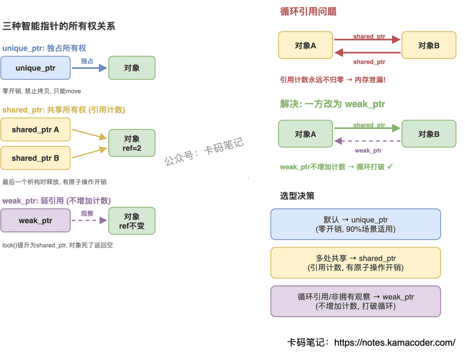
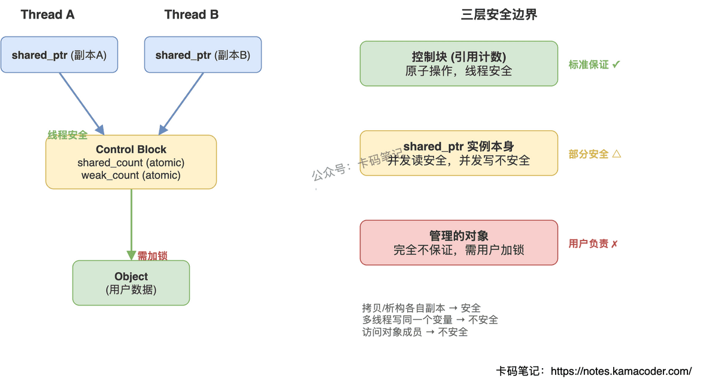

## 1. C++智能指针的区别与选型

面试官问"C++ 有哪几种智能指针，区别是什么"，大多数人能列出三个名字，但追问"什么时候该用 unique\_ptr、什么时候该用 shared\_ptr"就答不清楚了。这道题考的不是背定义，而是你对所有权语义的理解深度。

### 简要回答

三种智能指针本质上对应三种所有权模型：**unique\_ptr 独占**（同一时刻只有一个拥有者）、**shared\_ptr 共享**（多个拥有者通过引用计数协调）、**weak\_ptr 观察**（不参与所有权，只是"看一眼还在不在"）。选型的核心原则是：**能用 unique\_ptr 就不用 shared\_ptr，需要打破循环引用才用 weak\_ptr**。

### 详细回答

智能指针的底层思想是 RAII——把资源的生命周期绑定到对象的生命周期上，构造时获取资源，析构时自动释放，彻底消灭手动 delete 带来的泄漏风险。

**unique\_ptr — 独占所有权**

同一时刻只有一个 unique\_ptr 拥有资源。禁止拷贝，只能移动（`std::move`）。析构时直接 delete，零开销，性能和裸指针一样。90% 的场景应该优先用它——函数内部的局部资源、类的成员变量、工厂函数的返回值，都适合 unique\_ptr。

**shared\_ptr — 共享所有权**

多个 shared\_ptr 可以指向同一个对象，内部通过引用计数管理生命周期。最后一个 shared\_ptr 析构时释放资源。代价是每次拷贝/析构都要原子操作引用计数，比 unique\_ptr 重。只有在确实需要多个拥有者的场景才用——比如缓存、观察者模式中的共享资源。

**weak\_ptr — 弱引用/观察者**

不增加引用计数，不参与生命周期管理。通过 `lock()` 尝试提升为 shared\_ptr，如果对象已死就返回空。唯一用途：打破 shared\_ptr 的循环引用，或者在不确定对象是否还活着时安全地"探测"一下。

选型决策很简单：默认用 unique\_ptr；如果资源确实需要被多处共享，用 shared\_ptr；如果出现了循环引用或者需要非拥有性观察，用 weak\_ptr。

### 知识拓展

**Q：为什么说 unique\_ptr 是零开销的？**

因为它内部就是一个裸指针，没有引用计数、没有控制块、没有原子操作。编译器优化后，unique\_ptr 和裸指针生成的机器码完全一样。

**Q：shared\_ptr 的性能代价具体在哪？**

两方面：一是多了一个控制块的堆分配（用 `make_shared` 可以合并为一次分配）；二是每次拷贝和析构都要做原子加减操作，在高并发场景下这个开销不可忽视。

**Q：循环引用是怎么发生的？**

A 持有 shared\_ptr 指向 B，B 也持有 shared\_ptr 指向 A。两者的引用计数永远不会归零，内存永远不会释放。解决办法是把其中一方改成 weak\_ptr——weak\_ptr 不增加引用计数，打破了循环。

**Q：能不能用 unique\_ptr 代替 shared\_ptr？**

如果你能把所有权链条理清楚（谁创建、谁拥有、谁负责销毁），绝大多数场景都可以用 unique\_ptr。shared\_ptr 往往是"懒得想所有权"的妥协方案，用多了反而容易引入循环引用和性能问题。

---

## 2. 智能指针的实现原理

面试官问"智能指针的实现原理"，很多人能说出 RAII 和引用计数，但再往下追问——控制块里存了什么？weak\_ptr 怎么知道对象已经死了？make\_shared 为什么比 new 快？——就答不上来了。

这道题考的不是"会不会用"，而是你对底层机制理解到什么程度。

### 简要回答

智能指针本质是一个**类模板**，封装原始指针并重载 `*` 和 `->` 操作符，利用 **RAII 机制**在对象析构时自动释放资源。三种智能指针分别通过独占所有权、引用计数、弱引用来管理不同的生命周期场景。

### 详细回答

智能指针的核心思路：把裸指针包进一个栈上对象里，利用析构函数自动释放堆内存，彻底避免手动 delete 遗漏的问题。

**unique\_ptr — 独占所有权**

实现上很简单：删除拷贝构造和拷贝赋值，只保留移动语义。同一时刻只有一个 unique\_ptr 拥有资源，析构时直接 delete。零开销，性能和裸指针一样。

**shared\_ptr — 共享所有权**

核心是一个**控制块（Control Block）**，里面存两个原子计数器：`shared_count`（强引用数）和 `weak_count`（弱引用数）。每次拷贝 shared\_ptr，shared\_count 原子加 1；析构时原子减 1；减到 0 时释放资源对象。控制块本身要等 shared\_count 和 weak\_count 都为 0 才释放。

**weak\_ptr — 弱引用**

和 shared\_ptr 共享同一个控制块，但不增加 shared\_count。通过 `lock()` 尝试提升为 shared\_ptr——如果 shared\_count 已经为 0，lock() 返回空，说明对象已销毁。这就是它能解决循环引用的原因：两个对象互相持有 weak\_ptr 不会阻止对方析构。

### 知识拓展

**Q：make\_shared 比 new + shared\_ptr 好在哪？**

`make_shared<T>(args)` 一次分配就搞定对象和控制块（放在同一块内存里），而 `new T` + `shared_ptr` 构造需要两次分配。少一次 malloc，对缓存也更友好。

**Q：控制块什么时候释放？**

资源对象在 shared\_count 归零时释放，但控制块要等 weak\_count 也归零才释放。所以如果有 weak\_ptr 还活着，控制块这块内存会一直留着——这也是 make\_shared 的一个小代价：对象内存和控制块绑在一起，weak\_ptr 不死，对象那块内存也回收不了。

**Q：unique\_ptr 能转成 shared\_ptr 吗？**

可以，`shared_ptr<T> sp = std::move(up)` 就行，反过来不行。这是单向的所有权放大。

**Q：多线程下 shared\_ptr 安全吗？**

引用计数的加减是原子操作，线程安全。但 shared\_ptr 对象本身（指针值的读写）不是线程安全的——多个线程同时读写同一个 shared\_ptr 变量需要加锁。

---

## 3. 智能指针的线程安全性

面试官问"shared\_ptr 是线程安全的吗"，很多人直接答"是"或者"不是"——两种回答都不准确。这道题考的是你能不能把"哪部分安全、哪部分不安全"说清楚，答不出这个层次就会被追问到底。

### 简要回答

一句话：**控制块线程安全，对象访问不安全，指针实例本身的并发写也不安全**。shared\_ptr 的引用计数加减是原子操作，但它管理的对象和 shared\_ptr 变量本身都需要你自己加锁。

### 详细回答

智能指针的线程安全要分三个层面来看：

**第一层：控制块（引用计数）— 线程安全**

shared\_ptr 内部的控制块用 `std::atomic` 实现引用计数的加减。多个线程同时拷贝、析构各自持有的 shared\_ptr 副本，引用计数不会出错。这是标准保证的。

**第二层：shared\_ptr 实例本身 — 不安全**

同一个 shared\_ptr 变量，多个线程同时读没问题，但如果有线程在写（reset、赋值、移动），就必须加锁。因为写操作要同时修改内部指针和调整引用计数，不是一个原子步骤。

**第三层：管理的对象 — 不安全**

智能指针只管生命周期，不管对象内部的并发访问。多个线程通过各自的 shared\_ptr 副本访问同一个对象，读写对象的成员仍然需要 mutex 保护。

对于 unique\_ptr，它本身就是独占语义，不存在共享的场景。所有权转移（move）不是线程安全的，必须确保同一时刻只有一个线程操作它。

### 知识拓展

**Q：引用计数用的什么内存序？**

增加计数用 `memory_order_relaxed` 就够了，因为不需要同步其他数据。但减少计数用 `memory_order_acq_rel`——减到零时要释放对象，必须保证之前所有线程对对象的写入都对当前线程可见。

**Q：怎么安全地在线程间传递 shared\_ptr？**

最简单的方式是值传递——函数参数按值接收 shared\_ptr，拷贝时引用计数原子加一，各线程持有独立副本，互不干扰。如果要修改一个全局的 shared\_ptr 变量，C++20 提供了 `std::atomic<std::shared_ptr<T>>`，之前的版本只能用 mutex。

**Q：多线程同时读同一个 shared\_ptr 变量安全吗？**

安全。标准规定对同一个 shared\_ptr 实例的并发只读访问不构成数据竞争。但只要有一个线程在写，所有访问都必须同步。

**Q：为什么不把 shared\_ptr 整体做成原子的？**

性能代价太大。绝大多数场景下 shared\_ptr 是线程局部使用的，每次操作都走原子指令会白白浪费性能。C++20 的 `atomic<shared_ptr>` 是给真正需要跨线程共享同一个指针变量的场景准备的，按需使用。

---
