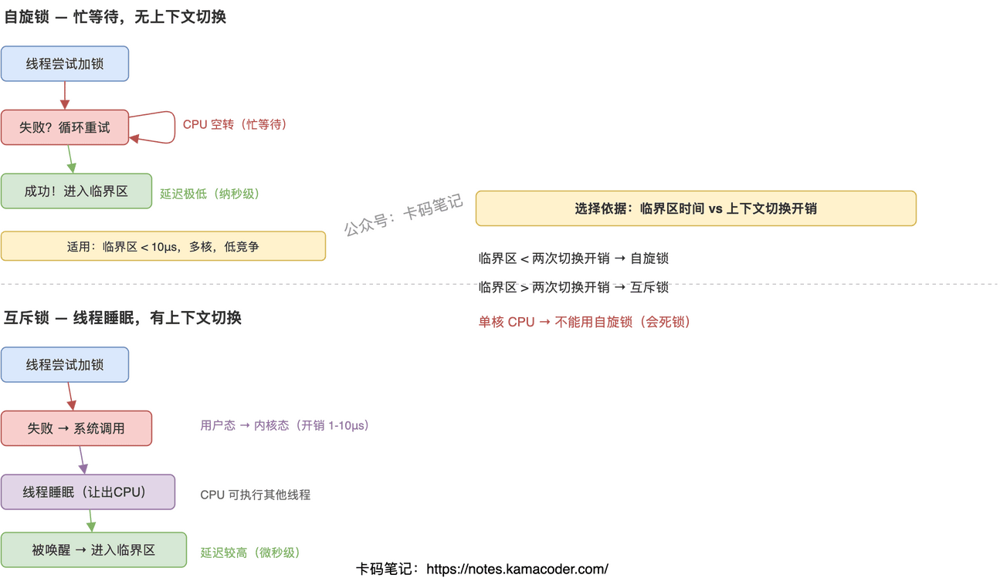

## 1. 自旋锁与互斥锁的性能对比及适用场景

面试官问"自旋锁和互斥锁有什么区别，什么时候用哪个"，大部分人能说出"自旋锁忙等待，互斥锁会睡眠"，但追问"性能拐点在哪里""单核为什么不能用自旋锁""自旋锁会不会活锁"就答不上来了。这道题的核心是理解：选择哪种锁取决于临界区执行时间和上下文切换开销的比较。

### 简要回答

自旋锁在用户态死循环检测锁状态（忙等待），拿到锁的瞬间延迟极低，但等待期间 CPU 一直在空转。互斥锁通过系统调用让拿不到锁的线程睡眠，CPU 可以去干别的事，但唤醒线程需要用户态→内核态→用户态两次切换，延迟高。判断标准很简单：如果临界区的执行时间短于两次上下文切换的开销（通常 1-10μs），用自旋锁划算；否则用互斥锁。

### 详细回答

**自旋锁怎么工作的**

自旋锁的核心是一个原子变量（比如 `std::atomic_flag`）。加锁时用 `test_and_set` 原子操作尝试把标志从 0 改成 1，如果失败说明别人持有锁，就在一个 `while` 循环里不断重试。解锁时把标志清零。整个过程不涉及系统调用，不会让线程睡眠，所以没有上下文切换开销。代价是等待期间 CPU 核心被完全占用，什么有用的事都干不了。

**互斥锁怎么工作的**

互斥锁（`std::mutex`）加锁失败时，会通过系统调用（Linux 上是 `futex`）把当前线程放到等待队列里并让它睡眠。持有锁的线程解锁时，内核会唤醒等待队列里的一个线程。这个过程涉及用户态到内核态的切换（保存/恢复寄存器、切换页表等），开销大约 1-10μs。好处是睡眠期间 CPU 核心可以执行其他线程。

**性能拐点在哪里**

如果临界区只做一两次内存读写（几十纳秒），自旋锁的忙等待开销远小于互斥锁的两次上下文切换开销，自旋锁性能更好。如果临界区要做 IO 操作、复杂计算（几十微秒以上），自旋锁让等待线程白白烧 CPU，互斥锁让线程睡眠反而更高效。经验值：临界区执行时间超过 10-20μs 就该用互斥锁。

**单核为什么不能用自旋锁**

单核 CPU 上只有一个执行流。如果线程 A 持有锁，线程 B 开始自旋等待，但 B 占着唯一的 CPU 核心不放，A 根本没机会运行来释放锁——形成类似死锁的状态。只有在可抢占内核（时间片到了强制切换）或者 B 主动 `yield()` 让出 CPU 的情况下，单核才能勉强用自旋锁，但这时候自旋锁的优势已经没了。

### 知识拓展

**Q：自旋锁会不会活锁？**

会。多个线程同时自旋竞争同一把锁时，可能出现"惊群效应"——所有线程都在自旋但谁也拿不到锁。解决办法：引入随机退避（每次失败后随机等待一小段时间再重试）、使用票据锁（ticket lock）保证公平性、或者用 MCS 锁减少缓存行争用。

**Q：如何确定自旋次数上限？**

实际工程中常用"自适应自旋"策略：先自旋一定次数（比如上下文切换开销的 1.5-2 倍），如果还拿不到锁就退化成互斥锁让线程睡眠。Java 的 `synchronized` 和 Linux 内核的 `mutex_lock` 都用了这种混合策略。

**Q：C++ 标准库有自旋锁吗？**

没有专门的自旋锁类，但可以用 `std::atomic_flag` 的 `test_and_set` + `clear` 自己实现。C++20 新增了 `std::atomic_flag::wait()` 和 `notify_one()`，可以实现更高效的等待。实际项目中如果需要自旋锁，通常用平台相关的实现（如 Linux 的 `pthread_spinlock_t`）。

**Q：读写锁和自旋锁/互斥锁是什么关系？**

读写锁是更高层的抽象——多个读者可以同时持有锁，但写者独占。读写锁的底层实现可以基于自旋锁（读多写少+短临界区场景）或互斥锁（长临界区场景）。C++ 标准库的 `std::shared_mutex` 底层通常基于互斥锁实现。

---

## 2. select、poll、epoll 的区别

面试官问"说一下 select、poll、epoll 的区别"，大多数人能答出"epoll 性能最好"，但追问"为什么好""好在哪""什么场景下 select 反而更合适"，就开始含糊了。

这道题考的是你对内核 IO 多路复用实现机制的理解深度。把"数据结构""通知方式""内核态到用户态的数据拷贝"三个维度讲清楚，面试官就不会继续追了。

### 简要回答

三者都是让**单线程同时监视多个 fd 就绪状态**的机制。核心区别在于：select 用位图、有 1024 限制、每次轮询 O(n)；poll 用数组、去掉数量限制、但仍 O(n) 遍历；epoll 用红黑树 + 就绪链表 + 事件回调，只返回活跃 fd，大量连接时性能碾压前两者。

### 详细回答

| 维度 | select | poll | epoll |
| --- | --- | --- | --- |
| 数据结构 | 位图 `fd_set` | `pollfd` 结构体数组 | 红黑树 + 就绪链表 |
| fd 数量限制 | 默认 1024（`FD_SETSIZE`） | 无硬性限制（受系统 `ulimit` 约束） | 无硬性限制 |
| 每次调用开销 | 重设 fd\_set + 拷贝到内核 + 遍历所有 fd | 拷贝整个数组到内核 + 遍历所有 fd | 只取就绪链表，无需遍历 |
| 就绪通知方式 | 返回后需遍历所有 fd 找就绪的 | 返回后需遍历所有 fd 找就绪的 | `epoll_wait` 直接返回就绪 fd 列表 |
| 时间复杂度 | O(n) | O(n) | O(活跃连接数) |
| 触发模式 | 仅水平触发（LT） | 仅水平触发（LT） | 支持 LT 和边缘触发（ET） |
| 跨平台 | 是（POSIX） | 是（POSIX） | 否（Linux 特有） |

**为什么 epoll 在大量连接时碾压 select/poll**

select/poll 每次调用都要把所有监控的 fd 从用户态拷贝到内核态，内核遍历所有 fd 检查就绪状态，返回后用户态再遍历一遍找到就绪的。连接数 1 万时，即使只有 10 个活跃，也要遍历 1 万次——这就是 O(n) 的代价。

epoll 的设计完全不同：`epoll_ctl` 注册 fd 时就把它挂到内核的红黑树上，之后不需要重复拷贝。当 fd 就绪时，内核通过回调把它加入就绪链表。`epoll_wait` 只需要检查就绪链表是否为空，非空就直接返回里面的 fd——不管总共监控了多少连接，开销只和活跃连接数成正比。

**LT 和 ET 的区别**

水平触发（LT，默认）：只要 fd 处于就绪状态，`epoll_wait` 每次都会返回它。编程简单，但如果不及时处理会反复通知。边缘触发（ET）：只在 fd 状态变化时通知一次，之后不再通知。必须一次性读完所有数据（用非阻塞 IO + 循环读到 `EAGAIN`），否则数据会丢。ET 减少了 `epoll_wait` 的返回次数，高并发场景性能更好，但编程复杂度更高。

### 知识拓展

**Q：连接数少的时候用哪个？**

连接数在几十到几百时，三者性能差异不大。如果需要跨平台（macOS/Windows），只能用 select/poll（epoll 是 Linux 特有的，macOS 用 kqueue，Windows 用 IOCP）。连接数少 + 跨平台需求 → select/poll；Linux + 高并发 → epoll。

**Q：epoll 的 mmap 是怎么回事？**

早期说法是 epoll 用 mmap 让内核和用户态共享内存来避免拷贝。实际上现代 Linux 内核实现中，`epoll_wait` 返回就绪事件时仍然有一次从内核到用户态的拷贝（`copy_to_user`），但因为只拷贝就绪的 fd（而非全部），数据量很小，开销可以忽略。真正省的是"注册时一次性拷贝 vs 每次调用都拷贝"。

**Q：select 的 1024 限制能改吗？**

可以修改 `FD_SETSIZE` 宏重新编译，但不推荐。因为 `fd_set` 是固定大小的位图，改大了栈空间开销也大。需要大量 fd 时直接用 poll 或 epoll。

**Q：ET 模式下为什么必须用非阻塞 IO？**

因为 ET 只通知一次，你必须循环读到 `EAGAIN` 才能确保数据读完。如果 fd 是阻塞的，最后一次 `read` 会卡住（没数据了但还在等），整个事件循环就死了。所以 ET + 非阻塞 IO 是固定搭配。

---
